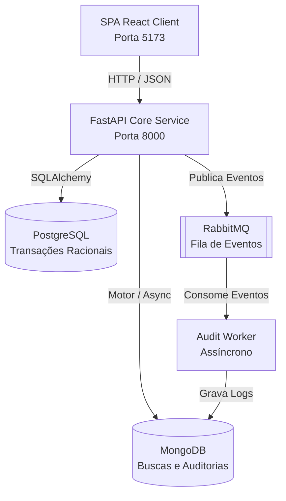

# Documentação Geral e Mapa de Arquitetura do Sistema

Esta documentação serve como guia técnico e contextual para o **Sistema de Reservas e Gestão Hoteleira**, desenvolvido para a disciplina de **Estágio II em Desenvolvimento Web** (Semestre 2026.2).

O objetivo deste documento é mapear toda a aplicação, explicando a arquitetura monorepo, as tecnologias utilizadas, o fluxo de comunicação entre as partes e a responsabilidade de cada diretório.

---

## 1. Visão Geral da Arquitetura (Macro)

O sistema adota uma arquitetura em **Monorepo**, contendo o frontend web, a API principal (Core Service) e serviços secundários de processamento assíncrono (Workers). 

A stack tecnológica principal é composta por:
* **Frontend**: React + Vite + Bootstrap (Client SPA).
* **API Gateway/Core**: FastAPI (Python 3.12) + SQLAlchemy (ORM) + Alembic (Migrações).
* **Mensageria**: RabbitMQ (Broker AMQP).
* **Worker Assíncrono**: Python Worker para consumo de filas.
* **Banco Relacional (Escrita/Reservas)**: PostgreSQL (Transacional).
* **Banco NoSQL (Catálogo/Busca/Logs)**: MongoDB (Leitura desnormalizada e Auditoria).

### Fluxo de Dados e Comunicação



---

## 2. Mapa do Código Fonte (Estrutura de Pastas)

Abaixo está o mapeamento detalhado da estrutura do repositório:

```text
/ (Raiz do Projeto)
├── docker-compose.yml             # Orquestrador local da stack (Postgres, Mongo, RabbitMQ, API, Worker e Front)
├── README.md                      # Documentação técnica oficial de introdução da disciplina
├── DOCUMENTACAO_SISTEMA.md        # Esta documentação atual (mapa do sistema)
│
├── apps/
│   ├── frontend/                  # Aplicação Cliente (React)
│   │   ├── Dockerfile             # Containerização do frontend com Nginx em produção
│   │   ├── package.json           # Manifesto de dependências do Node.js
│   │   ├── vite.config.js         # Configurações de build rápida com Vite
│   │   └── src/
│   │       ├── App.jsx            # Componente de controle principal (Rotas e Layout)
│   │       ├── main.jsx           # Ponto de entrada do React
│   │       ├── custom.css         # Estilização CSS vanilla customizada
│   │       └── components/        # Componentes reutilizáveis (Telas de demonstração)
│   │
│   └── services/
│       └── core-service/          # Backend FastAPI (API Principal + Worker)
│           ├── Dockerfile         # Instruções de montagem da imagem docker do backend
│           ├── requirements.txt   # Dependências Python gerenciadas pelo pip
│           ├── pyproject.toml     # Configurações e dependências no padrão Poetry
│           ├── alembic.ini        # Arquivo de configuração de migrações SQL
│           │
│           ├── app/               # Módulos principais do app Python
│           │   ├── main.py        # Inicialização do FastAPI, Middleware e LIFESPAN
│           │   │
│           │   ├── api/           # Camada de Entrada / HTTP Controllers
│           │   │   ├── deps.py    # Injeção de Dependências (Guards, Sessão de Banco)
│           │   │   └── v1/        # Endpoints versão 1 (auth, health, sobre, etc.)
│           │   │
│           │   ├── core/          # Configurações de Sistema e Conexões
│           │   │   ├── config.py  # Definições PydanticSettings (leitura de .env)
│           │   │   ├── database.py# Conexões do PostgreSQL (SQLAlchemy) e MongoDB (Motor)
│           │   │   └── rabbitmq.py# Helpers de conexão e publicação do RabbitMQ
│           │   │
│           │   ├── models/        # Entidades Relacionais (SQLAlchemy Models)
│           │   │   └── tutorial.py# Tabelas iniciais (Professores, Disciplinas, Stacks)
│           │   │
│           │   ├── schemas/       # DTOs / Esquemas de validação (Pydantic Models)
│           │   │   ├── usuario.py # Schemas para login e perfil do usuário
│           │   │   └── tutorial.py# Schemas de visualização e criação de dados
│           │   │
│           │   ├── repositories/  # Camada de Acesso a Dados (SQL queries isoladas)
│           │   │   └── tutorial_repository.py
│           │   │
│           │   ├── services/      # Camada de Regras de Negócio e Casos de Uso
│           │   │   └── tutorial_service.py
│           │   │
│           │   └── workers/       # Processamento em Background
│           │       └── audit_worker.py # Script worker que lê filas do RabbitMQ e insere no Mongo
│           │
│           ├── alembic/           # Scripts de migração de schema do PostgreSQL
│           │   ├── env.py         # Configuração de contexto do Alembic
│           │   └── versions/      # Arquivos de alteração de banco incremental (.py)
│           │
│           └── tests/             # Suíte de Testes Automatizados (Pytest)
│               ├── conftest.py    # Fixtures de banco SQLite em memória e HTTPClient
│               └── test_api.py    # Casos de teste de integração de rotas
```

---

## 3. Detalhamento Técnico das Camadas do Backend

O backend utiliza o padrão de **Arquitetura Limpa** dividida em camadas lógicas para garantir separação de responsabilidades:

1. **Camada de Entrada (`app/api`)**:
   * O arquivo `deps.py` define dependências críticas que FastAPI injeta nas funções do controller. Por exemplo, `get_db` abre uma sessão transacional do Postgres e fecha após a requisição; `get_current_user` valida se quem chamou a rota possui privilégios de acesso.
   * As rotas são divididas por domínio em `v1/`. Elas recebem payloads, chamam a camada de serviço e retornam respostas serializadas.
2. **Camada de Schemas (`app/schemas`)**:
   * Define classes usando **Pydantic**. Os schemas validam os dados na entrada da API (ex: tamanho mínimo de senha ou formatos de string) e modelam exatamente o JSON que sairá na resposta da API, prevenindo o vazamento acidental de campos sensíveis (como hashes de senhas).
3. **Camada de Regras de Negócio (`app/services`)**:
   * Onde reside a lógica pura da aplicação. Ela gerencia o fluxo de controle, calcula taxas (como o motor de precificação de estadias), decide quando publicar um evento e delega a gravação no banco aos repositórios.
4. **Camada de Repositórios (`app/repositories`)**:
   * É a responsável direta por conversar com o SQLAlchemy. Esconde as chamadas SQL e otimizações (como `joinedload` para evitar o problema de consulta N+1).
5. **Camada de Modelos (`app/models`)**:
   * Representa o mapeamento direto das tabelas relacionais do PostgreSQL.

---

## 4. O Sistema de Mensageria e Bancos NoSQL

Uma característica avançada deste boilerplate é o uso combinado de diferentes bancos (SQL e NoSQL) e mensageria distribuída (RabbitMQ):

### 4.1. Por que RabbitMQ?
Algumas ações são demoradas (como validar pagamentos de reservas ou mandar e-mails de confirmação). Se fizermos isso de forma síncrona na rota da API, o usuário ficará com a tela travada esperando.
* O backend recebe a solicitação, grava um status `Pendente` no Postgres, coloca uma mensagem no **RabbitMQ** e imediatamente retorna o status `202 Accepted` para o frontend.
* O **Worker** (`audit_worker.py`) roda em segundo plano, lê a mensagem da fila, processa as regras de auditoria e executa a tarefa sem que o usuário precise esperar de forma síncrona.

### 4.2. O papel do MongoDB (NoSQL)
Enquanto o **PostgreSQL** cuida das transações consistentes do dia a dia (garantindo que dois quartos idênticos não sejam alugados ao mesmo tempo), o **MongoDB** é utilizado para:
1. **Logs de Auditoria**: Guardar histórico detalhado de tudo o que aconteceu no sistema (por ter um esquema flexível, ideal para documentos JSON dinâmicos).
2. **Busca Rápida de Hotéis**: O catalogo é periodicamente sincronizado com o MongoDB. O frontend busca informações no Mongo pois ele possui alta performance de leitura para dados desnormalizados.

---

## 5. Como o Frontend se Conecta

O frontend React é estruturado de forma reativa:
* Ele renderiza a tela e, através do hook `useEffect`, faz chamadas assíncronas utilizando a função `fetch` para a API Gateway (rodando na porta `8000`).
* Ele possui um layout shell (com navbar lateral em `components/Sidebar.jsx` e conteúdo central em `App.jsx`).
* Ao longo das próximas Sprints, as telas de exemplo acadêmicas (exibições de professores e tabelas de stacks) deverão ser substituídas pelos componentes específicos do gerenciador de hotelaria (lista de quartos disponíveis, formulários de checkout e painel de reservas do usuário).
