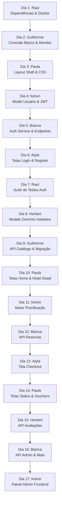

# 📘 Playbook de Execução Diária — Equipe Bravo (2026.2)

**Projeto Oficial (Onde subimos as tasks/PRs):** [prof-ronildo-unicatolica/est_web_2026_2_turma_b_bravo](https://github.com/prof-ronildo-unicatolica/est_web_2026_2_turma_b_bravo)  
**Repositório Fonte (Onde os arquivos prontos ficam guardados):** [DevKelvinbd/est_web_2026_2_turma_b_bravo](https://github.com/DevKelvinbd/est_web_2026_2_turma_b_bravo)  
**Branch de Integração Oficial:** `develop`  
**Branch Fonte dos Arquivos Prontos:** `fonte/backup/stayflow-completo`  

---

> ⚠️ **ATENÇÃO — CRONOGRAMA EMERGENCIAL REVISADO:**  
> Por determinação do calendário acadêmico/disciplina, todas as entregas das **Sprints 1 a 8 (Tarefas 1.1 até 8.4)** devem ser finalizadas, revisadas e integradas na branch `develop` **impreterivelmente até 25/09/2026 às 23:59**.

## 👥 Integrantes e Ciclo de Code Review (Anel Fechado de 7 Integrantes)

Para garantir que todos os integrantes contribuam tanto na submissão de código quanto no processo de revisão (critério avaliativo da disciplina), adotamos o **anel fechado de revisão por pares**:

| # | Integrante | Papel Principal | Revisa PR de quem? |
|---|---|---|---|
| 1 | **Kelvin Barros Dias** | Líder Backend / Auth / Core | ➔ Revisa PRs do **Herbert** |
| 2 | **Paula de Freitas Mendes Barbosa** | Líder Frontend / UI / Catálogo | ➔ Revisa PRs do **Kelvin Barros** |
| 3 | **Guilherme Neves de Assis** | Backend / Banco de Dados / Catálogo | ➔ Revisa PRs da **Paula de Freitas** |
| 4 | **Francisca Bianca da Silva** | Backend / Schemas / Reservas & Admin | ➔ Revisa PRs do **Guilherme Neves** |
| 5 | **Raul de Queiroz Moura** | DevOps / Docker / QA / Testes | ➔ Revisa PRs da **Francisca Bianca** |
| 6 | **Atyla Braga** | Fullstack / Auth Frontend / Checkout | ➔ Revisa PRs do **Raul de Queiroz** |
| 7 | **Herbert Monteiro** | Backend & Frontend / Modelos & Avaliações | ➔ Revisa PRs do **Atyla Braga** |

---

## ⚡ Preparação Única na Máquina de Cada Aluno

Antes da primeira task, o aluno configura o repositório oficial e adiciona o repositório de download com o comando:

```bash
# 1. Clonar o repositório oficial da turma:
git clone https://github.com/prof-ronildo-unicatolica/est_web_2026_2_turma_b_bravo.git
cd est_web_2026_2_turma_b_bravo

# 2. Adicionar o repositório fonte de download dos arquivos:
git remote add fonte https://github.com/DevKelvinbd/est_web_2026_2_turma_b_bravo.git
git fetch fonte
```

---

## 🚀 Como Funciona a Execução Rápida (Zero Esforço)

Todos os arquivos do projeto já estão 100% implementados na branch de backup `fonte/backup/stayflow-completo`.  
Para cumprir cada tarefa:
1. Atualize sua branch `develop` a partir da oficial:
   ```bash
   git checkout develop && git pull origin develop
   ```
2. Crie a branch da task indicada:
   ```bash
   git checkout -b <nome-da-branch>
   ```
3. Copie o arquivo pronto diretamente do repositório fonte usando o comando:
   ```bash
   git checkout fonte/backup/stayflow-completo -- <caminho-do-arquivo>
   ```
4. Faça o `git commit` com a mensagem indicada no roteiro.
5. Dê `git push -u origin <nome-da-branch>` para enviar ao repositório oficial da turma.
6. Abra o Pull Request no GitHub da turma apontando para a `develop`.
7. O revisor indicado acessa o GitHub oficial, aprova o PR e faz o Merge.

---

## 📅 Roteiro Diário de Subida das Tarefas (7 Integrantes)



---

### 🚀 SPRINT 1 — Fundação, Infra e Setup

---

#### 📌 Dia 1 | Tarefa 1.1 — Atualização de Dependências e Docker
* **Responsável:** **Raul de Queiroz Moura**
* **Revisor Obrigatório:** **Atyla Braga**
* **Branch:** `chore/docker-env-config`
* **Arquivos:**
  * `.gitignore`
  * `apps/services/core-service/requirements.txt`
  * `apps/services/core-service/pyproject.toml`
* **Passo a passo no terminal:**
  ```bash
  git checkout develop
  git pull origin develop
  git checkout -b chore/docker-env-config
  git checkout fonte/backup/stayflow-completo -- .gitignore apps/services/core-service/requirements.txt apps/services/core-service/pyproject.toml
  git add .gitignore apps/services/core-service/requirements.txt apps/services/core-service/pyproject.toml
  git commit -m "chore(infra): atualiza dependencias e variaveis de ambiente da stack"
  git push -u origin chore/docker-env-config
  ```
* **Abertura do PR:**
  * **Repositório:** [prof-ronildo-unicatolica/est_web_2026_2_turma_b_bravo](https://github.com/prof-ronildo-unicatolica/est_web_2026_2_turma_b_bravo)
  * **Base:** `develop` | **Head:** `chore/docker-env-config`
  * **Título:** `[Sprint 1] Chore: Configuração de dependências e ambiente Docker`
  * **Reviewer:** Atyla Braga

---

#### 📌 Dia 2 | Tarefa 1.2 — Configuração de Conexão com Banco e Alembic
* **Responsável:** **Guilherme Neves de Assis**
* **Revisor Obrigatório:** **Francisca Bianca da Silva**
* **Branch:** `feature/db-initial-connection`
* **Arquivos:**
  * `apps/services/core-service/app/core/config.py`
  * `apps/services/core-service/alembic/env.py`
* **Passo a passo no terminal:**
  ```bash
  git checkout develop
  git pull origin develop
  git checkout -b feature/db-initial-connection
  git checkout fonte/backup/stayflow-completo -- apps/services/core-service/app/core/config.py apps/services/core-service/alembic/env.py
  git add apps/services/core-service/app/core/config.py apps/services/core-service/alembic/env.py
  git commit -m "feat(db): configura conexao unificada sqlalchemy e alembic"
  git push -u origin feature/db-initial-connection
  ```
* **Abertura do PR:**
  * **Base:** `develop` | **Head:** `feature/db-initial-connection`
  * **Título:** `[Sprint 1] Feat: Conexão e configuração do banco de dados e Alembic`
  * **Reviewer:** Francisca Bianca da Silva

---

#### 📌 Dia 3 | Tarefa 1.3 — Shell de Layout e Design System CSS
* **Responsável:** **Paula de Freitas Mendes Barbosa**
* **Revisor Obrigatório:** **Guilherme Neves de Assis**
* **Branch:** `feature/frontend-shell-layout`
* **Arquivos:**
  * `apps/frontend/package.json`
  * `apps/frontend/package-lock.json`
  * `apps/frontend/src/components/layout/Navbar.jsx`
  * `apps/frontend/src/components/layout/Footer.jsx`
  * `apps/frontend/src/index.css`
* **Passo a passo no terminal:**
  ```bash
  git checkout develop
  git pull origin develop
  git checkout -b feature/frontend-shell-layout
  git checkout fonte/backup/stayflow-completo -- apps/frontend/package.json apps/frontend/package-lock.json apps/frontend/src/components/layout/Navbar.jsx apps/frontend/src/components/layout/Footer.jsx apps/frontend/src/index.css
  git add apps/frontend/package.json apps/frontend/package-lock.json apps/frontend/src/components/layout/Navbar.jsx apps/frontend/src/components/layout/Footer.jsx apps/frontend/src/index.css
  git commit -m "feat(frontend): cria componentes de layout Navbar, Footer e tokens css"
  git push -u origin feature/frontend-shell-layout
  ```
* **Abertura do PR:**
  * **Base:** `develop` | **Head:** `feature/frontend-shell-layout`
  * **Título:** `[Sprint 1] Feat: Layout Shell e Design System CSS do Frontend`
  * **Reviewer:** Guilherme Neves de Assis

---

### 🔑 SPRINT 2 — Autenticação & Autorização JWT + RBAC

---

#### 📌 Dia 4 | Tarefa 2.1 — Modelo de Usuário, Hash Bcrypt e Segurança JWT
* **Responsável:** **Kelvin Barros Dias**
* **Revisor Obrigatório:** **Paula de Freitas Mendes Barbosa**
* **Branch:** `feature/auth-security-jwt-backend`
* **Arquivos:**
  * `apps/services/core-service/app/models/usuario.py`
  * `apps/services/core-service/app/core/security.py`
  * `apps/services/core-service/app/schemas/auth.py`
* **Passo a passo no terminal:**
  ```bash
  git checkout develop
  git pull origin develop
  git checkout -b feature/auth-security-jwt-backend
  git checkout fonte/backup/stayflow-completo -- apps/services/core-service/app/models/usuario.py apps/services/core-service/app/core/security.py apps/services/core-service/app/schemas/auth.py
  git add apps/services/core-service/app/models/usuario.py apps/services/core-service/app/core/security.py apps/services/core-service/app/schemas/auth.py
  git commit -m "feat(auth): implementa modelo de usuario, hash bcrypt e geracao jwt"
  git push -u origin feature/auth-security-jwt-backend
  ```
* **Abertura do PR:**
  * **Base:** `develop` | **Head:** `feature/auth-security-jwt-backend`
  * **Título:** `[Sprint 2] Feat: Modelo de Usuário, Hashing e Segurança JWT`
  * **Reviewer:** Paula de Freitas Mendes Barbosa

---

#### 📌 Dia 5 | Tarefa 2.2 — Serviço de Auth, Dependências RBAC e Endpoints
* **Responsável:** **Francisca Bianca da Silva**
* **Revisor Obrigatório:** **Raul de Queiroz Moura**
* **Branch:** `feature/auth-endpoints-service`
* **Arquivos:**
  * `apps/services/core-service/app/services/auth_service.py`
  * `apps/services/core-service/app/api/deps.py`
  * `apps/services/core-service/app/api/v1/auth.py`
  * `apps/services/core-service/app/db/__init__.py`
  * `apps/services/core-service/app/db/seed.py`
* **Passo a passo no terminal:**
  ```bash
  git checkout develop
  git pull origin develop
  git checkout -b feature/auth-endpoints-service
  git checkout fonte/backup/stayflow-completo -- apps/services/core-service/app/services/auth_service.py apps/services/core-service/app/api/deps.py apps/services/core-service/app/api/v1/auth.py apps/services/core-service/app/db/__init__.py apps/services/core-service/app/db/seed.py
  git add apps/services/core-service/app/services/auth_service.py apps/services/core-service/app/api/deps.py apps/services/core-service/app/api/v1/auth.py apps/services/core-service/app/db/__init__.py apps/services/core-service/app/db/seed.py
  git commit -m "feat(auth): implementa servico de autenticacao, dependencias rbac e endpoints auth"
  git push -u origin feature/auth-endpoints-service
  ```
* **Abertura do PR:**
  * **Base:** `develop` | **Head:** `feature/auth-endpoints-service`
  * **Título:** `[Sprint 2] Feat: Serviço de Autenticação, Guards RBAC e Endpoints /auth`
  * **Reviewer:** Raul de Queiroz Moura

---

#### 📌 Dia 6 | Tarefa 2.3 — Telas de Login/Registro e Contexto de Autenticação
* **Responsável:** **Atyla Braga**
* **Revisor Obrigatório:** **Herbert**
* **Branch:** `feature/frontend-auth-integration`
* **Arquivos:**
  * `apps/frontend/src/services/api.js`
  * `apps/frontend/src/contexts/AuthContext.jsx`
  * `apps/frontend/src/components/layout/ProtectedRoute.jsx`
  * `apps/frontend/src/pages/LoginPage.jsx`
  * `apps/frontend/src/pages/RegisterPage.jsx`
* **Passo a passo no terminal:**
  ```bash
  git checkout develop
  git pull origin develop
  git checkout -b feature/frontend-auth-integration
  git checkout fonte/backup/stayflow-completo -- apps/frontend/src/services/api.js apps/frontend/src/contexts/AuthContext.jsx apps/frontend/src/components/layout/ProtectedRoute.jsx apps/frontend/src/pages/LoginPage.jsx apps/frontend/src/pages/RegisterPage.jsx
  git add apps/frontend/src/services/api.js apps/frontend/src/contexts/AuthContext.jsx apps/frontend/src/components/layout/ProtectedRoute.jsx apps/frontend/src/pages/LoginPage.jsx apps/frontend/src/pages/RegisterPage.jsx
  git commit -m "feat(frontend): implementa auth context, interceptor jwt e telas de login e cadastro"
  git push -u origin feature/frontend-auth-integration
  ```
* **Abertura do PR:**
  * **Base:** `develop` | **Head:** `feature/frontend-auth-integration`
  * **Título:** `[Sprint 2] Feat: Telas de Login/Registro e Contexto de Autenticação com JWT`
  * **Reviewer:** Herbert

---

#### 📌 Dia 7 | Tarefa 2.4 — Suíte de Testes Automatizados JWT & RBAC
* **Responsável:** **Raul de Queiroz Moura**
* **Revisor Obrigatório:** **Atyla Braga**
* **Branch:** `test/auth-integration-suite`
* **Arquivos:**
  * `apps/services/core-service/tests/conftest.py`
  * `apps/services/core-service/tests/test_auth_jwt.py`
* **Passo a passo no terminal:**
  ```bash
  git checkout develop
  git pull origin develop
  git checkout -b test/auth-integration-suite
  git checkout fonte/backup/stayflow-completo -- apps/services/core-service/tests/conftest.py apps/services/core-service/tests/test_auth_jwt.py
  git add apps/services/core-service/tests/conftest.py apps/services/core-service/tests/test_auth_jwt.py
  git commit -m "test(auth): implementa suite de testes automatizados para fluxos jwt e rbac"
  git push -u origin test/auth-integration-suite
  ```
* **Abertura do PR:**
  * **Base:** `develop` | **Head:** `test/auth-integration-suite`
  * **Título:** `[Sprint 2] Test: Suíte de testes de integração JWT e permissões RBAC`
  * **Reviewer:** Atyla Braga

---

### 🏨 SPRINT 3 — Domínio Hoteleiro & Catálogo de Hotéis

---

#### 📌 Dia 8 | Tarefa 3.1 — Modelos ORM e Schemas Pydantic do Domínio Hoteleiro
* **Responsável:** **Herbert**
* **Revisor Obrigatório:** **Kelvin Barros Dias**
* **Branch:** `feature/hotel-models-schemas`
* **Arquivos:**
  * `apps/services/core-service/app/models/cidade.py`
  * `apps/services/core-service/app/models/hotel.py`
  * `apps/services/core-service/app/models/comodidade.py`
  * `apps/services/core-service/app/models/quarto.py`
  * `apps/services/core-service/app/models/__init__.py`
  * `apps/services/core-service/app/schemas/hotelaria.py`
* **Passo a passo no terminal:**
  ```bash
  git checkout develop
  git pull origin develop
  git checkout -b feature/hotel-models-schemas
  git checkout fonte/backup/stayflow-completo -- apps/services/core-service/app/models/cidade.py apps/services/core-service/app/models/hotel.py apps/services/core-service/app/models/comodidade.py apps/services/core-service/app/models/quarto.py apps/services/core-service/app/models/__init__.py apps/services/core-service/app/schemas/hotelaria.py
  git add apps/services/core-service/app/models/cidade.py apps/services/core-service/app/models/hotel.py apps/services/core-service/app/models/comodidade.py apps/services/core-service/app/models/quarto.py apps/services/core-service/app/models/__init__.py apps/services/core-service/app/schemas/hotelaria.py
  git commit -m "feat(models): implementa modelos orm e schemas pydantic para cidade, hotel, quarto e comodidades"
  git push -u origin feature/hotel-models-schemas
  ```
* **Abertura do PR:**
  * **Base:** `develop` | **Head:** `feature/hotel-models-schemas`
  * **Título:** `[Sprint 3] Feat: Modelos SQLAlchemy e Schemas Pydantic do Domínio Hoteleiro`
  * **Reviewer:** Kelvin Barros Dias

---

#### 📌 Dia 9 | Tarefa 3.2 — Endpoints de Catálogo e Migração Alembic
* **Responsável:** **Guilherme Neves de Assis**
* **Revisor Obrigatório:** **Francisca Bianca da Silva**
* **Branch:** `feature/hotel-catalog-api`
* **Arquivos:**
  * `apps/services/core-service/app/api/v1/hoteis.py`
  * `apps/services/core-service/alembic/versions/f519176e1f37_add_stayflow_domain_models.py`
* **Passo a passo no terminal:**
  ```bash
  git checkout develop
  git pull origin develop
  git checkout -b feature/hotel-catalog-api
  git checkout fonte/backup/stayflow-completo -- apps/services/core-service/app/api/v1/hoteis.py apps/services/core-service/alembic/versions/f519176e1f37_add_stayflow_domain_models.py
  git add apps/services/core-service/app/api/v1/hoteis.py apps/services/core-service/alembic/versions/f519176e1f37_add_stayflow_domain_models.py
  git commit -m "feat(api): implementa endpoints de busca e catalogo de hoteis e migracao alembic"
  git push -u origin feature/hotel-catalog-api
  ```
* **Abertura do PR:**
  * **Base:** `develop` | **Head:** `feature/hotel-catalog-api`
  * **Título:** `[Sprint 3] Feat: Endpoints de Catálogo de Hotéis e Migração Alembic`
  * **Reviewer:** Francisca Bianca da Silva

---

#### 📌 Dia 10 | Tarefa 3.3 — Telas de Busca de Hotéis e Detalhes da Acomodação
* **Responsável:** **Paula de Freitas Mendes Barbosa**
* **Revisor Obrigatório:** **Guilherme Neves de Assis**
* **Branch:** `feature/frontend-hotel-catalog`
* **Arquivos:**
  * `apps/frontend/src/pages/HomePage.jsx`
  * `apps/frontend/src/pages/HotelDetailPage.jsx`
* **Passo a passo no terminal:**
  ```bash
  git checkout develop
  git pull origin develop
  git checkout -b feature/frontend-hotel-catalog
  git checkout fonte/backup/stayflow-completo -- apps/frontend/src/pages/HomePage.jsx apps/frontend/src/pages/HotelDetailPage.jsx
  git add apps/frontend/src/pages/HomePage.jsx apps/frontend/src/pages/HotelDetailPage.jsx
  git commit -m "feat(frontend): implementa telas de home com busca de hoteis e detalhes com quartos"
  git push -u origin feature/frontend-hotel-catalog
  ```
* **Abertura do PR:**
  * **Base:** `develop` | **Head:** `feature/frontend-hotel-catalog`
  * **Título:** `[Sprint 3] Feat: Telas de Busca de Hotéis e Detalhes da Acomodação`
  * **Reviewer:** Guilherme Neves de Assis

---

### 💳 SPRINT 4 — Motor de Reservas & Precificação Dinâmica

---

#### 📌 Dia 11 | Tarefa 4.1 — Motor de Precificação Dinâmica e Modelos de Reserva
* **Responsável:** **Kelvin Barros Dias**
* **Revisor Obrigatório:** **Paula de Freitas Mendes Barbosa**
* **Branch:** `feature/booking-pricing-engine`
* **Arquivos:**
  * `apps/services/core-service/app/models/reserva.py`
  * `apps/services/core-service/app/models/tarifa_temporada.py`
  * `apps/services/core-service/app/models/servico_adicional.py`
  * `apps/services/core-service/app/services/pricing_service.py`
* **Passo a passo no terminal:**
  ```bash
  git checkout develop
  git pull origin develop
  git checkout -b feature/booking-pricing-engine
  git checkout fonte/backup/stayflow-completo -- apps/services/core-service/app/models/reserva.py apps/services/core-service/app/models/tarifa_temporada.py apps/services/core-service/app/models/servico_adicional.py apps/services/core-service/app/services/pricing_service.py
  git add apps/services/core-service/app/models/reserva.py apps/services/core-service/app/models/tarifa_temporada.py apps/services/core-service/app/models/servico_adicional.py apps/services/core-service/app/services/pricing_service.py
  git commit -m "feat(pricing): implementa modelos de reservas e temporadas com motor de precificacao dinamica"
  git push -u origin feature/booking-pricing-engine
  ```
* **Abertura do PR:**
  * **Base:** `develop` | **Head:** `feature/booking-pricing-engine`
  * **Título:** `[Sprint 4] Feat: Motor de Precificação Dinâmica e Modelos de Reserva`
  * **Reviewer:** Paula de Freitas Mendes Barbosa

---

#### 📌 Dia 12 | Tarefa 4.2 — Endpoints REST para Criação e Gestão de Reservas
* **Responsável:** **Francisca Bianca da Silva**
* **Revisor Obrigatório:** **Raul de Queiroz Moura**
* **Branch:** `feature/booking-api-endpoints`
* **Arquivos:**
  * `apps/services/core-service/app/api/v1/reservas.py`
* **Passo a passo no terminal:**
  ```bash
  git checkout develop
  git pull origin develop
  git checkout -b feature/booking-api-endpoints
  git checkout fonte/backup/stayflow-completo -- apps/services/core-service/app/api/v1/reservas.py
  git add apps/services/core-service/app/api/v1/reservas.py
  git commit -m "feat(api): implementa endpoints de criacao, simulacao e cancelamento de reservas"
  git push -u origin feature/booking-api-endpoints
  ```
* **Abertura do PR:**
  * **Base:** `develop` | **Head:** `feature/booking-api-endpoints`
  * **Título:** `[Sprint 4] Feat: Endpoints REST para Criação e Gestão de Reservas`
  * **Reviewer:** Raul de Queiroz Moura

---

#### 📌 Dia 13 | Tarefa 4.3 — Tela de Checkout com Simulação em Tempo Real
* **Responsável:** **Atyla Braga**
* **Revisor Obrigatório:** **Herbert**
* **Branch:** `feature/frontend-checkout-booking`
* **Arquivos:**
  * `apps/frontend/src/pages/CheckoutPage.jsx`
* **Passo a passo no terminal:**
  ```bash
  git checkout develop
  git pull origin develop
  git checkout -b feature/frontend-checkout-booking
  git checkout fonte/backup/stayflow-completo -- apps/frontend/src/pages/CheckoutPage.jsx
  git add apps/frontend/src/pages/CheckoutPage.jsx
  git commit -m "feat(frontend): implementa tela de checkout com calculo em tempo real e servicos adicionais"
  git push -u origin feature/frontend-checkout-booking
  ```
* **Abertura do PR:**
  * **Base:** `develop` | **Head:** `feature/frontend-checkout-booking`
  * **Título:** `[Sprint 4] Feat: Tela de Checkout Interativo com Cálculo em Tempo Real`
  * **Reviewer:** Herbert

---

### 🎫 SPRINT 5 — Vouchers, Minhas Reservas & Avaliações

---

#### 📌 Dia 14 | Tarefa 5.1 — Telas de Status de Reserva, Voucher e Histórico
* **Responsável:** **Paula de Freitas Mendes Barbosa**
* **Revisor Obrigatório:** **Guilherme Neves de Assis**
* **Branch:** `feature/frontend-booking-status-voucher`
* **Arquivos:**
  * `apps/frontend/src/pages/BookingStatusPage.jsx`
  * `apps/frontend/src/pages/MyBookingsPage.jsx`
* **Passo a passo no terminal:**
  ```bash
  git checkout develop
  git pull origin develop
  git checkout -b feature/frontend-booking-status-voucher
  git checkout fonte/backup/stayflow-completo -- apps/frontend/src/pages/BookingStatusPage.jsx apps/frontend/src/pages/MyBookingsPage.jsx
  git add apps/frontend/src/pages/BookingStatusPage.jsx apps/frontend/src/pages/MyBookingsPage.jsx
  git commit -m "feat(frontend): implementa tela de status/voucher e painel de minhas reservas com cancelamento"
  git push -u origin feature/frontend-booking-status-voucher
  ```
* **Abertura do PR:**
  * **Base:** `develop` | **Head:** `feature/frontend-booking-status-voucher`
  * **Título:** `[Sprint 5] Feat: Telas de Status de Reserva, Voucher e Minhas Reservas`
  * **Reviewer:** Guilherme Neves de Assis

---

#### 📌 Dia 15 | Tarefa 5.2 — Módulo de Avaliações e Notas dos Hotéis
* **Responsável:** **Herbert**
* **Revisor Obrigatório:** **Kelvin Barros Dias**
* **Branch:** `feature/reviews-ratings-api`
* **Arquivos:**
  * `apps/services/core-service/app/models/avaliacao.py`
  * `apps/services/core-service/app/api/v1/avaliacoes.py`
* **Passo a passo no terminal:**
  ```bash
  git checkout develop
  git pull origin develop
  git checkout -b feature/reviews-ratings-api
  git checkout fonte/backup/stayflow-completo -- apps/services/core-service/app/models/avaliacao.py apps/services/core-service/app/api/v1/avaliacoes.py
  git add apps/services/core-service/app/models/avaliacao.py apps/services/core-service/app/api/v1/avaliacoes.py
  git commit -m "feat(api): implementa modelo e endpoints de avaliacoes e notas de hoteis"
  git push -u origin feature/reviews-ratings-api
  ```
* **Abertura do PR:**
  * **Base:** `develop` | **Head:** `feature/reviews-ratings-api`
  * **Título:** `[Sprint 5] Feat: Módulo de Avaliações e Notas de Hotéis`
  * **Reviewer:** Kelvin Barros Dias

---

### 📊 SPRINT 6 — Painel Administrativo & Orquestração Final

---

#### 📌 Dia 16 | Tarefa 6.1 — Endpoints Administrativos e Registro Geral da API
* **Responsável:** **Francisca Bianca da Silva**
* **Revisor Obrigatório:** **Raul de Queiroz Moura**
* **Branch:** `feature/admin-dashboard-backend`
* **Arquivos:**
  * `apps/services/core-service/app/api/v1/admin.py`
  * `apps/services/core-service/app/main.py`
* **Passo a passo no terminal:**
  ```bash
  git checkout develop
  git pull origin develop
  git checkout -b feature/admin-dashboard-backend
  git checkout fonte/backup/stayflow-completo -- apps/services/core-service/app/api/v1/admin.py apps/services/core-service/app/main.py
  git add apps/services/core-service/app/api/v1/admin.py apps/services/core-service/app/main.py
  git commit -m "feat(admin): implementa endpoints administrativos de gestao e registro geral de rotas"
  git push -u origin feature/admin-dashboard-backend
  ```
* **Abertura do PR:**
  * **Base:** `develop` | **Head:** `feature/admin-dashboard-backend`
  * **Título:** `[Sprint 6] Feat: Endpoints Administrativos e Registro Geral de Rotas`
  * **Reviewer:** Raul de Queiroz Moura

---

#### 📌 Dia 17 | Tarefa 6.2 — Painel Administrativo e Roteamento Geral da Aplicação
* **Responsável:** **Kelvin Barros Dias**
* **Revisor Obrigatório:** **Paula de Freitas Mendes Barbosa**
* **Branch:** `feature/admin-dashboard-frontend`
* **Arquivos:**
  * `apps/frontend/src/pages/admin/AdminDashboard.jsx`
  * `apps/frontend/src/App.jsx`
  * `apps/frontend/src/main.jsx`
  * `apps/frontend/index.html`
* **Passo a passo no terminal:**
  ```bash
  git checkout develop
  git pull origin develop
  git checkout -b feature/admin-dashboard-frontend
  git checkout fonte/backup/stayflow-completo -- apps/frontend/src/pages/admin/AdminDashboard.jsx apps/frontend/src/App.jsx apps/frontend/src/main.jsx apps/frontend/index.html
  git add apps/frontend/src/pages/admin/AdminDashboard.jsx apps/frontend/src/App.jsx apps/frontend/src/main.jsx apps/frontend/index.html
  git commit -m "feat(frontend): implementa painel administrativo integrado e rotas protegidas no app"
  git push -u origin feature/admin-dashboard-frontend
  ```
* **Abertura do PR:**
  * **Base:** `develop` | **Head:** `feature/admin-dashboard-frontend`
  * **Título:** `[Sprint 6] Feat: Painel Administrativo e Roteamento Geral da Aplicação`
  * **Reviewer:** Paula de Freitas Mendes Barbosa

---

---

### ⚡ SPRINT 7 — Mensageria Assíncrona, Auditoria NoSQL & CI/CD Pipeline

---

#### 📌 Dia 18 | Tarefa 7.1 — Pipeline de CI/CD Automatizado no GitHub Actions
* **Responsável:** **Raul de Queiroz Moura**
* **Revisor Obrigatório:** **Kelvin Barros Dias**
* **Branch:** `chore/ci-github-actions`
* **Arquivos:**
  * `.github/workflows/ci.yml`
* **Passo a passo no terminal:**
  ```bash
  git checkout develop
  git pull origin develop
  git checkout -b chore/ci-github-actions
  # Criar .github/workflows/ci.yml com checagem de lint e testes automatizados
  git add .github/workflows/ci.yml
  git commit -m "chore(ci): implementa pipeline automatizado de testes e lint no github actions"
  git push -u origin chore/ci-github-actions
  ```
* **Abertura do PR:**
  * **Base:** `develop` | **Head:** `chore/ci-github-actions`
  * **Título:** `[Sprint 7] Chore: Pipeline de CI/CD automatizado no GitHub Actions`
  * **Reviewer:** Kelvin Barros Dias

---

#### 📌 Dia 19 | Tarefa 7.2 — Publicação e Consumo de Eventos de Auditoria no RabbitMQ & MongoDB
* **Responsável:** **Guilherme Neves de Assis**
* **Revisor Obrigatório:** **Francisca Bianca da Silva**
* **Branch:** `feature/rabbitmq-audit-worker`
* **Arquivos:**
  * `apps/services/core-service/app/workers/audit_worker.py`
  * `apps/services/core-service/app/core/rabbitmq.py`
* **Passo a passo no terminal:**
  ```bash
  git checkout develop
  git pull origin develop
  git checkout -b feature/rabbitmq-audit-worker
  git add apps/services/core-service/app/workers/audit_worker.py apps/services/core-service/app/core/rabbitmq.py
  git commit -m "feat(worker): conecta publicacao e consumo de eventos assincronos com rabbitmq e mongodb"
  git push -u origin feature/rabbitmq-audit-worker
  ```
* **Abertura do PR:**
  * **Base:** `develop` | **Head:** `feature/rabbitmq-audit-worker`
  * **Título:** `[Sprint 7] Feat: Mensageria assíncrona com RabbitMQ e Worker MongoDB`
  * **Reviewer:** Francisca Bianca da Silva

---

#### 📌 Dia 20 | Tarefa 7.3 — Endpoint e Visualizador de Logs de Auditoria NoSQL no Painel Admin
* **Responsável:** **Atyla Braga**
* **Revisor Obrigatório:** **Paula de Freitas Mendes Barbosa**
* **Branch:** `feature/admin-audit-logs-view`
* **Arquivos:**
  * `apps/services/core-service/app/api/v1/admin.py`
  * `apps/frontend/src/pages/admin/AdminDashboard.jsx`
* **Passo a passo no terminal:**
  ```bash
  git checkout develop
  git pull origin develop
  git checkout -b feature/admin-audit-logs-view
  git add apps/services/core-service/app/api/v1/admin.py apps/frontend/src/pages/admin/AdminDashboard.jsx
  git commit -m "feat(admin): implementa consulta e aba visual de logs de auditoria assincronos"
  git push -u origin feature/admin-audit-logs-view
  ```
* **Abertura do PR:**
  * **Base:** `develop` | **Head:** `feature/admin-audit-logs-view`
  * **Título:** `[Sprint 7] Feat: Endpoint e tela de logs de auditoria no painel administrativo`
  * **Reviewer:** Paula de Freitas Mendes Barbosa

---

### 🏆 SPRINT 8 — Suíte de Testes E2E, Seed Completo da Banca & Release Final v1.0.0

---

#### 📌 Dia 21 | Tarefa 8.1 — Suíte Abrangente de Testes de Integração do Domínio e Relatório de Cobertura
* **Responsável:** **Raul de Queiroz Moura**
* **Revisor Obrigatório:** **Atyla Braga**
* **Branch:** `test/domain-integration-suite`
* **Arquivos:**
  * `apps/services/core-service/tests/test_hoteis.py`
  * `apps/services/core-service/tests/test_reservas.py`
* **Passo a passo no terminal:**
  ```bash
  git checkout develop
  git pull origin develop
  git checkout -b test/domain-integration-suite
  git add apps/services/core-service/tests/test_hoteis.py apps/services/core-service/tests/test_reservas.py
  git commit -m "test(qa): implementa suite de testes de integracao para hoteis, calculo de reservas e cancelamento"
  git push -u origin test/domain-integration-suite
  ```
* **Abertura do PR:**
  * **Base:** `develop` | **Head:** `test/domain-integration-suite`
  * **Título:** `[Sprint 8] Test: Suíte completa de testes de integração para o domínio hoteleiro`
  * **Reviewer:** Atyla Braga

---

#### 📌 Dia 22 | Tarefa 8.2 — Script de Carga de Dados Realista (Seed Completo da Banca)
* **Responsável:** **Herbert Monteiro**
* **Revisor Obrigatório:** **Guilherme Neves de Assis**
* **Branch:** `feature/seed-catalog-demo`
* **Arquivos:**
  * `apps/services/core-service/app/db/seed_demo.py`
* **Passo a passo no terminal:**
  ```bash
  git checkout develop
  git pull origin develop
  git checkout -b feature/seed-catalog-demo
  git add apps/services/core-service/app/db/seed_demo.py
  git commit -m "feat(db): adiciona script de seed completo com cidades, hoteis, quartos e reservas para demonstracao"
  git push -u origin feature/seed-catalog-demo
  ```
* **Abertura do PR:**
  * **Base:** `develop` | **Head:** `feature/seed-catalog-demo`
  * **Título:** `[Sprint 8] Feat: Script de seed de dados completo para demonstração e banca`
  * **Reviewer:** Guilherme Neves de Assis

---

#### 📌 Dia 23 | Tarefa 8.3 — Polimento de UI/UX, Feedback Visual (Toasts/Loading) e Tratamento de Erros
* **Responsável:** **Paula de Freitas Mendes Barbosa**
* **Revisor Obrigatório:** **Kelvin Barros Dias**
* **Branch:** `feature/frontend-ux-polish`
* **Arquivos:**
  * `apps/frontend/src/components/common/Toast.jsx`
  * `apps/frontend/src/custom.css`
* **Passo a passo no terminal:**
  ```bash
  git checkout develop
  git pull origin develop
  git checkout -b feature/frontend-ux-polish
  git add apps/frontend/src/components/common/Toast.jsx apps/frontend/src/custom.css
  git commit -m "feat(frontend): adiciona feedback visual de toasts, skeletons e polimento de UI"
  git push -u origin feature/frontend-ux-polish
  ```
* **Abertura do PR:**
  * **Base:** `develop` | **Head:** `feature/frontend-ux-polish`
  * **Título:** `[Sprint 8] Feat: Polimento visual de UI/UX, toasts e estados de carregamento`
  * **Reviewer:** Kelvin Barros Dias

---

#### 📌 Dia 24 | Tarefa 8.4 — Orquestração de Release Final, Roteiro da Banca e Tag v1.0.0
* **Responsáveis:** **Kelvin Barros Dias** e **Francisca Bianca da Silva**
* **Revisor Obrigatório:** **Raul de Queiroz Moura**
* **Branch:** `chore/release-v1.0.0-prep`
* **Arquivos:**
  * `Gestão do Projeto/ROTEIRO_APRESENTACAO_BANCA.md`
  * `README.md`
* **Passo a passo no terminal:**
  ```bash
  git checkout develop
  git pull origin develop
  git checkout -b chore/release-v1.0.0-prep
  git add "Gestão do Projeto/ROTEIRO_APRESENTACAO_BANCA.md" README.md
  git commit -m "chore(release): prepara roteiro da banca avaliadora e orquestracao final v1.0.0"
  git push -u origin chore/release-v1.0.0-prep
  ```
* **Abertura do PR:**
  * **Base:** `develop` | **Head:** `chore/release-v1.0.0-prep`
  * **Título:** `[Sprint 8] Chore: Orquestração de entrega final e release v1.0.0 para branch main`
  * **Reviewer:** Raul de Queiroz Moura

---

## 🎯 Resumo Final de Entregas por Integrante (24 Entregas - 7 Membros)

> **Prazo Impreterível:** **25/09/2026 às 23:59**

| Integrante | Total PRs Autor | Total PRs Revisor | Frentes de Atuação nas Sprints 1 a 8 |
|---|:---:|:---:|---|
| **Kelvin Barros Dias** | **4** (Dias 4, 11, 17, 24) | **4** (Dias 8, 15, 18, 23) | Auth JWT, Pricing Engine, Admin Frontend e Release v1.0.0 |
| **Paula de Freitas Mendes Barbosa** | **4** (Dias 3, 10, 14, 23) | **4** (Dias 4, 11, 17, 20) | Layout Shell, Catálogo UI, Vouchers e Polimento UI/UX |
| **Guilherme Neves de Assis** | **3** (Dias 2, 9, 19) | **4** (Dias 3, 10, 14, 22) | Conexão DB, Alembic, Catálogo API e Mensageria RabbitMQ |
| **Francisca Bianca da Silva** | **4** (Dias 5, 12, 16, 24) | **3** (Dias 2, 9, 19) | Auth Endpoints, Reservas API, Admin Backend e Release v1.0.0 |
| **Raul de Queiroz Moura** | **4** (Dias 1, 7, 18, 21) | **4** (Dias 5, 12, 16, 24) | Docker/Env, Testes Auth, CI/CD Actions, Testes Domínio & QA |
| **Atyla Braga** | **3** (Dias 6, 13, 20) | **3** (Dias 1, 7, 21) | Telas Auth, Checkout Interativo e Visualizador NoSQL Admin |
| **Herbert Monteiro** | **3** (Dias 8, 15, 22) | **3** (Dias 6, 13, 19) | Modelos Domínio, Avaliações API e Seed Completo da Banca |

