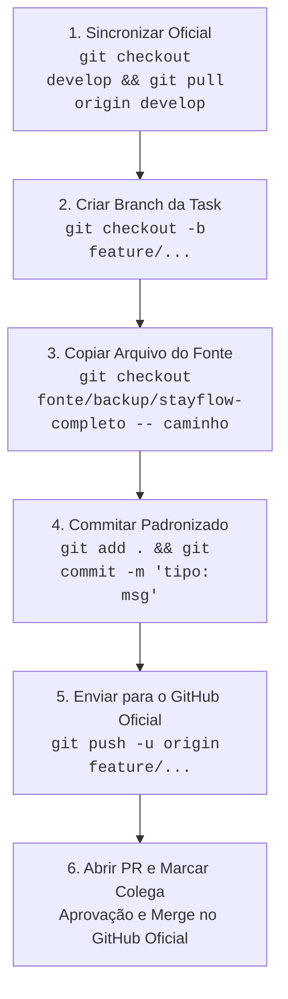

# 🛠️ Guia Prático de Execução das Tasks — Equipe Bravo (2026.2)

**Projeto Oficial da Disciplina (Onde subimos os PRs):** [https://github.com/prof-ronildo-unicatolica/est_web_2026_2_turma_b_bravo](https://github.com/prof-ronildo-unicatolica/est_web_2026_2_turma_b_bravo)  
**Repositório Fonte de Arquivos Prontos (Download):** [https://github.com/DevKelvinbd/est_web_2026_2_turma_b_bravo](https://github.com/DevKelvinbd/est_web_2026_2_turma_b_bravo)  
**Documento de Referência:** [05_playbook_execucao_diaria_equipe.md](./05_playbook_execucao_diaria_equipe.md)

---

> ⚠️ **PRAZO EMERGENCIAL REVISADO:** Todas as entregas das **Sprints 1 a 8 (Tarefas 1.1 até 8.4)** devem ser finalizadas, revisadas e integradas na branch `develop` **impreterivelmente até 25/09/2026 às 23:59**.

## 🎯 Objetivo deste Guia

Este documento é o manual prático e visual para todos os **7 integrantes** da equipe (**Kelvin, Paula, Guilherme, Bianca, Raul, Atyla e Herbert**). Ele explica exatamente **o que fazer**, **como rodar cada comando**, **como abrir o Pull Request (PR)** e **como o colega deve aprovar e mesclar** no GitHub oficial da turma.

> [!TIP]
> **Você não precisará programar nada do zero.** Todo o código-fonte já está pronto e validado na branch `fonte/backup/stayflow-completo`. Sua única função é extrair os arquivos, commitar no padrão, abrir o PR no repositório da disciplina e aprovar as entregas dos colegas.

---

## 🧭 1. Preparação Inicial (Fazer apenas uma vez)

Antes de iniciar o seu primeiro dia de trabalho:

1. **Clone o repositório oficial da disciplina:**
   ```bash
   git clone https://github.com/prof-ronildo-unicatolica/est_web_2026_2_turma_b_bravo.git
   cd est_web_2026_2_turma_b_bravo
   ```
2. **Adicione o repositório de download com os arquivos prontos:**
   ```bash
   git remote add fonte https://github.com/DevKelvinbd/est_web_2026_2_turma_b_bravo.git
   git fetch fonte
   ```
3. **Garanta que você está na branch `develop` oficial atualizada:**
   ```bash
   git checkout develop
   git pull origin develop
   ```

---

## 🔄 2. O Ciclo Padrão de 6 Passos para Qualquer Task

Sempre que chegar o seu dia na escala, siga rigorosamente este fluxo:



### Detalhamento dos 6 Passos:

1. **Sincronizar a branch `develop` do repositório oficial:**
   ```bash
   git checkout develop
   git pull origin develop
   ```
2. **Criar a branch da sua tarefa a partir da `develop`:**
   ```bash
   git checkout -b <nome-da-branch>
   ```
3. **Extrair os arquivos prontos da branch `fonte/backup/stayflow-completo`:**
   ```bash
   git checkout fonte/backup/stayflow-completo -- <arquivo1> <arquivo2>
   ```
4. **Adicionar e criar o commit com a mensagem convencional:**
   ```bash
   git add <arquivos>
   git commit -m "<mensagem-do-playbook>"
   ```
5. **Enviar sua branch para o repositório oficial da disciplina (`origin`):**
   ```bash
   git push -u origin <nome-da-branch>
   ```
6. **Abrir o Pull Request no GitHub Oficial:**
   * Acesse: [https://github.com/prof-ronildo-unicatolica/est_web_2026_2_turma_b_bravo/pulls](https://github.com/prof-ronildo-unicatolica/est_web_2026_2_turma_b_bravo/pulls)
   * Clique em **"New pull request"** (ou "Compare & pull request").
   * **Base repository:** `develop` (⚠️ NUNCA selecione `main`).
   * **Título do PR:** `[Sprint X] Tipo: Descrição resumida`
   * **Reviewers:** Selecione no menu lateral direito o colega definido no ciclo de Code Review.

---

## 📋 3. Roteiro Passo a Passo de Cada Tarefa (Dias 1 ao 17)

---

### 🚀 SPRINT 1 — Fundação e Setup

#### 📌 Dia 1 | Tarefa 1.1 — Atualização de Dependências e Docker
* **Quem executa:** **Raul de Queiroz Moura**
* **Quem aprova o PR:** **Atyla Braga**
* **O que faz:** Atualiza os manifests de dependências (`requirements.txt`, `pyproject.toml`) e regras do `.gitignore`.
* **Comandos para copiar e colar:**
  ```bash
  git checkout develop
  git pull origin develop
  git checkout -b chore/docker-env-config
  git checkout fonte/backup/stayflow-completo -- .gitignore apps/services/core-service/requirements.txt apps/services/core-service/pyproject.toml
  git add .gitignore apps/services/core-service/requirements.txt apps/services/core-service/pyproject.toml
  git commit -m "chore(infra): atualiza dependencias e variaveis de ambiente da stack"
  git push -u origin chore/docker-env-config
  ```
* **No GitHub Oficial:** Abrir PR de `chore/docker-env-config` para `develop` marcando **Atyla Braga** como Reviewer.

---

#### 📌 Dia 2 | Tarefa 1.2 — Configuração de Conexão com Banco e Alembic
* **Quem executa:** **Guilherme Neves de Assis**
* **Quem aprova o PR:** **Francisca Bianca da Silva**
* **O que faz:** Configura a conexão SQLAlchemy e o ambiente de migrações automáticas do Alembic.
* **Comandos para copiar e colar:**
  ```bash
  git checkout develop
  git pull origin develop
  git checkout -b feature/db-initial-connection
  git checkout fonte/backup/stayflow-completo -- apps/services/core-service/app/core/config.py apps/services/core-service/alembic/env.py
  git add apps/services/core-service/app/core/config.py apps/services/core-service/alembic/env.py
  git commit -m "feat(db): configura conexao unificada sqlalchemy e alembic"
  git push -u origin feature/db-initial-connection
  ```
* **No GitHub Oficial:** Abrir PR de `feature/db-initial-connection` para `develop` marcando **Bianca** como Reviewer.

---

#### 📌 Dia 3 | Tarefa 1.3 — Shell de Layout e Design System CSS
* **Quem executa:** **Paula de Freitas Mendes Barbosa**
* **Quem aprova o PR:** **Guilherme Neves de Assis**
* **O que faz:** Cria a estrutura visual da aplicação React, componentes `Navbar`, `Footer` e tokens de estilo `index.css`.
* **Comandos para copiar e colar:**
  ```bash
  git checkout develop
  git pull origin develop
  git checkout -b feature/frontend-shell-layout
  git checkout fonte/backup/stayflow-completo -- apps/frontend/package.json apps/frontend/package-lock.json apps/frontend/src/components/layout/Navbar.jsx apps/frontend/src/components/layout/Footer.jsx apps/frontend/src/index.css
  git add apps/frontend/package.json apps/frontend/package-lock.json apps/frontend/src/components/layout/Navbar.jsx apps/frontend/src/components/layout/Footer.jsx apps/frontend/src/index.css
  git commit -m "feat(frontend): cria componentes de layout Navbar, Footer e tokens css"
  git push -u origin feature/frontend-shell-layout
  ```
* **No GitHub Oficial:** Abrir PR de `feature/frontend-shell-layout` para `develop` marcando **Guilherme** como Reviewer.

---

### 🔑 SPRINT 2 — Autenticação JWT & RBAC

#### 📌 Dia 4 | Tarefa 2.1 — Modelo de Usuário, Hash Bcrypt e Segurança JWT
* **Quem executa:** **Kelvin Barros Dias**
* **Quem aprova o PR:** **Paula de Freitas Mendes Barbosa**
* **O que faz:** Modela a entidade de usuários com `passlib/bcrypt` e cria gerador de token JWT.
* **Comandos para copiar e colar:**
  ```bash
  git checkout develop
  git pull origin develop
  git checkout -b feature/auth-security-jwt-backend
  git checkout fonte/backup/stayflow-completo -- apps/services/core-service/app/models/usuario.py apps/services/core-service/app/core/security.py apps/services/core-service/app/schemas/auth.py
  git add apps/services/core-service/app/models/usuario.py apps/services/core-service/app/core/security.py apps/services/core-service/app/schemas/auth.py
  git commit -m "feat(auth): implementa modelo de usuario, hash bcrypt e geracao jwt"
  git push -u origin feature/auth-security-jwt-backend
  ```
* **No GitHub Oficial:** Abrir PR de `feature/auth-security-jwt-backend` para `develop` marcando **Paula** como Reviewer.

---

#### 📌 Dia 5 | Tarefa 2.2 — Serviço de Auth, Dependências RBAC e Endpoints
* **Quem executa:** **Francisca Bianca da Silva**
* **Quem aprova o PR:** **Raul de Queiroz Moura**
* **O que faz:** Implementa regras de negócio de login/registro, guardas de autorização (`get_current_admin`) e seed de admin.
* **Comandos para copiar e colar:**
  ```bash
  git checkout develop
  git pull origin develop
  git checkout -b feature/auth-endpoints-service
  git checkout fonte/backup/stayflow-completo -- apps/services/core-service/app/services/auth_service.py apps/services/core-service/app/api/deps.py apps/services/core-service/app/api/v1/auth.py apps/services/core-service/app/db/__init__.py apps/services/core-service/app/db/seed.py
  git add apps/services/core-service/app/services/auth_service.py apps/services/core-service/app/api/deps.py apps/services/core-service/app/api/v1/auth.py apps/services/core-service/app/db/__init__.py apps/services/core-service/app/db/seed.py
  git commit -m "feat(auth): implementa servico de autenticacao, dependencias rbac e endpoints auth"
  git push -u origin feature/auth-endpoints-service
  ```
* **No GitHub Oficial:** Abrir PR de `feature/auth-endpoints-service` para `develop` marcando **Raul** como Reviewer.

---

#### 📌 Dia 6 | Tarefa 2.3 — Telas de Login/Registro e Contexto de Autenticação
* **Quem executa:** **Atyla Braga**
* **Quem aprova o PR:** **Herbert**
* **O que faz:** Constrói formulários reativos de Login/Cadastro, `AuthContext` e interceptor de token JWT no Axios.
* **Comandos para copiar e colar:**
  ```bash
  git checkout develop
  git pull origin develop
  git checkout -b feature/frontend-auth-integration
  git checkout fonte/backup/stayflow-completo -- apps/frontend/src/services/api.js apps/frontend/src/contexts/AuthContext.jsx apps/frontend/src/components/layout/ProtectedRoute.jsx apps/frontend/src/pages/LoginPage.jsx apps/frontend/src/pages/RegisterPage.jsx
  git add apps/frontend/src/services/api.js apps/frontend/src/contexts/AuthContext.jsx apps/frontend/src/components/layout/ProtectedRoute.jsx apps/frontend/src/pages/LoginPage.jsx apps/frontend/src/pages/RegisterPage.jsx
  git commit -m "feat(frontend): implementa auth context, interceptor jwt e telas de login e cadastro"
  git push -u origin feature/frontend-auth-integration
  ```
* **No GitHub Oficial:** Abrir PR de `feature/frontend-auth-integration` para `develop` marcando **Herbert** como Reviewer.

---

#### 📌 Dia 7 | Tarefa 2.4 — Suíte de Testes Automatizados JWT & RBAC
* **Quem executa:** **Raul de Queiroz Moura**
* **Quem aprova o PR:** **Atyla Braga**
* **O que faz:** Cria fixtures no `conftest.py` e testes de integração com Pytest para cobertura 100% de Auth.
* **Comandos para copiar e colar:**
  ```bash
  git checkout develop
  git pull origin develop
  git checkout -b test/auth-integration-suite
  git checkout fonte/backup/stayflow-completo -- apps/services/core-service/tests/conftest.py apps/services/core-service/tests/test_auth_jwt.py
  git add apps/services/core-service/tests/conftest.py apps/services/core-service/tests/test_auth_jwt.py
  git commit -m "test(auth): implementa suite de testes automatizados para fluxos jwt e rbac"
  git push -u origin test/auth-integration-suite
  ```
* **No GitHub Oficial:** Abrir PR de `test/auth-integration-suite` para `develop` marcando **Atyla Braga** como Reviewer.

---

### 🏨 SPRINT 3 — Domínio Hoteleiro & Catálogo de Hotéis

#### 📌 Dia 8 | Tarefa 3.1 — Modelos ORM e Schemas Pydantic do Domínio Hoteleiro
* **Quem executa:** **Herbert**
* **Quem aprova o PR:** **Kelvin Barros Dias**
* **O que faz:** Cria modelos relacionais (`Cidade`, `Hotel`, `Quarto`, `Comodidade`) e schemas de entrada/saída.
* **Comandos para copiar e colar:**
  ```bash
  git checkout develop
  git pull origin develop
  git checkout -b feature/hotel-models-schemas
  git checkout fonte/backup/stayflow-completo -- apps/services/core-service/app/models/cidade.py apps/services/core-service/app/models/hotel.py apps/services/core-service/app/models/comodidade.py apps/services/core-service/app/models/quarto.py apps/services/core-service/app/models/__init__.py apps/services/core-service/app/schemas/hotelaria.py
  git add apps/services/core-service/app/models/cidade.py apps/services/core-service/app/models/hotel.py apps/services/core-service/app/models/comodidade.py apps/services/core-service/app/models/quarto.py apps/services/core-service/app/models/__init__.py apps/services/core-service/app/schemas/hotelaria.py
  git commit -m "feat(models): implementa modelos orm e schemas pydantic para cidade, hotel, quarto e comodidades"
  git push -u origin feature/hotel-models-schemas
  ```
* **No GitHub Oficial:** Abrir PR de `feature/hotel-models-schemas` para `develop` marcando **Kelvin** como Reviewer.

---

#### 📌 Dia 9 | Tarefa 3.2 — Endpoints de Catálogo e Migração Alembic
* **Quem executa:** **Guilherme Neves de Assis**
* **Quem aprova o PR:** **Francisca Bianca da Silva**
* **O que faz:** Cria rotas de consulta pública e filtros de hotéis (`/api/v1/hoteis`) com migração Alembic.
* **Comandos para copiar e colar:**
  ```bash
  git checkout develop
  git pull origin develop
  git checkout -b feature/hotel-catalog-api
  git checkout fonte/backup/stayflow-completo -- apps/services/core-service/app/api/v1/hoteis.py apps/services/core-service/alembic/versions/f519176e1f37_add_stayflow_domain_models.py
  git add apps/services/core-service/app/api/v1/hoteis.py apps/services/core-service/alembic/versions/f519176e1f37_add_stayflow_domain_models.py
  git commit -m "feat(api): implementa endpoints de busca e catalogo de hoteis e migracao alembic"
  git push -u origin feature/hotel-catalog-api
  ```
* **No GitHub Oficial:** Abrir PR de `feature/hotel-catalog-api` para `develop` marcando **Bianca** como Reviewer.

---

#### 📌 Dia 10 | Tarefa 3.3 — Telas de Busca de Hotéis e Detalhes da Acomodação
* **Quem executa:** **Paula de Freitas Mendes Barbosa**
* **Quem aprova o PR:** **Guilherme Neves de Assis**
* **O que faz:** Desenvolve telas de Home com filtros dinâmicos de cidades e página detalhada de quartos e comodidades.
* **Comandos para copiar e colar:**
  ```bash
  git checkout develop
  git pull origin develop
  git checkout -b feature/frontend-hotel-catalog
  git checkout fonte/backup/stayflow-completo -- apps/frontend/src/pages/HomePage.jsx apps/frontend/src/pages/HotelDetailPage.jsx
  git add apps/frontend/src/pages/HomePage.jsx apps/frontend/src/pages/HotelDetailPage.jsx
  git commit -m "feat(frontend): implementa telas de home com busca de hoteis e detalhes com quartos"
  git push -u origin feature/frontend-hotel-catalog
  ```
* **No GitHub Oficial:** Abrir PR de `feature/frontend-hotel-catalog` para `develop` marcando **Guilherme** como Reviewer.

---

### 💳 SPRINT 4 — Motor de Reservas & Precificação Dinâmica

#### 📌 Dia 11 | Tarefa 4.1 — Motor de Precificação Dinâmica e Modelos de Reserva
* **Quem executa:** **Kelvin Barros Dias**
* **Quem aprova o PR:** **Paula de Freitas Mendes Barbosa**
* **O que faz:** Implementa o cálculo inteligente de diárias considerando sazonalidade, tarifas de temporada e serviços adicionais.
* **Comandos para copiar e colar:**
  ```bash
  git checkout develop
  git pull origin develop
  git checkout -b feature/booking-pricing-engine
  git checkout fonte/backup/stayflow-completo -- apps/services/core-service/app/models/reserva.py apps/services/core-service/app/models/tarifa_temporada.py apps/services/core-service/app/models/servico_adicional.py apps/services/core-service/app/services/pricing_service.py
  git add apps/services/core-service/app/models/reserva.py apps/services/core-service/app/models/tarifa_temporada.py apps/services/core-service/app/models/servico_adicional.py apps/services/core-service/app/services/pricing_service.py
  git commit -m "feat(pricing): implementa modelos de reservas e temporadas com motor de precificacao dinamica"
  git push -u origin feature/booking-pricing-engine
  ```
* **No GitHub Oficial:** Abrir PR de `feature/booking-pricing-engine` para `develop` marcando **Paula** como Reviewer.

---

#### 📌 Dia 12 | Tarefa 4.2 — Endpoints REST para Criação e Gestão de Reservas
* **Quem executa:** **Francisca Bianca da Silva**
* **Quem aprova o PR:** **Raul de Queiroz Moura**
* **O que faz:** Cria endpoints de simulação, reserva efetiva e cancelamento com validações de conflito de datas.
* **Comandos para copiar e colar:**
  ```bash
  git checkout develop
  git pull origin develop
  git checkout -b feature/booking-api-endpoints
  git checkout fonte/backup/stayflow-completo -- apps/services/core-service/app/api/v1/reservas.py
  git add apps/services/core-service/app/api/v1/reservas.py
  git commit -m "feat(api): implementa endpoints de criacao, simulacao e cancelamento de reservas"
  git push -u origin feature/booking-api-endpoints
  ```
* **No GitHub Oficial:** Abrir PR de `feature/booking-api-endpoints` para `develop` marcando **Raul** como Reviewer.

---

#### 📌 Dia 13 | Tarefa 4.3 — Tela de Checkout com Simulação em Tempo Real
* **Quem executa:** **Atyla Braga**
* **Quem aprova o PR:** **Herbert**
* **O que faz:** Desenvolve formulário de reserva com seleção de datas, cálculo instantâneo de diárias e seleção de adicionais.
* **Comandos para copiar e colar:**
  ```bash
  git checkout develop
  git pull origin develop
  git checkout -b feature/frontend-checkout-booking
  git checkout fonte/backup/stayflow-completo -- apps/frontend/src/pages/CheckoutPage.jsx
  git add apps/frontend/src/pages/CheckoutPage.jsx
  git commit -m "feat(frontend): implementa tela de checkout com calculo em tempo real e servicos adicionais"
  git push -u origin feature/frontend-checkout-booking
  ```
* **No GitHub Oficial:** Abrir PR de `feature/frontend-checkout-booking` para `develop` marcando **Herbert** como Reviewer.

---

### 🎫 SPRINT 5 — Vouchers, Minhas Reservas & Avaliações

#### 📌 Dia 14 | Tarefa 5.1 — Telas de Status de Reserva, Voucher e Histórico
* **Quem executa:** **Paula de Freitas Mendes Barbosa**
* **Quem aprova o PR:** **Guilherme Neves de Assis**
* **O que faz:** Cria tela de confirmação de reserva com voucher digital formatado e painel de histórico de reservas do cliente.
* **Comandos para copiar e colar:**
  ```bash
  git checkout develop
  git pull origin develop
  git checkout -b feature/frontend-booking-status-voucher
  git checkout fonte/backup/stayflow-completo -- apps/frontend/src/pages/BookingStatusPage.jsx apps/frontend/src/pages/MyBookingsPage.jsx
  git add apps/frontend/src/pages/BookingStatusPage.jsx apps/frontend/src/pages/MyBookingsPage.jsx
  git commit -m "feat(frontend): implementa tela de status/voucher e painel de minhas reservas com cancelamento"
  git push -u origin feature/frontend-booking-status-voucher
  ```
* **No GitHub Oficial:** Abrir PR de `feature/frontend-booking-status-voucher` para `develop` marcando **Guilherme** como Reviewer.

---

#### 📌 Dia 15 | Tarefa 5.2 — Módulo de Avaliações e Notas dos Hotéis
* **Quem executa:** **Herbert**
* **Quem aprova o PR:** **Kelvin Barros Dias**
* **O que faz:** Implementa modelo de avaliações, pontuação com estrelas e endpoints de envio de feedback dos hóspedes.
* **Comandos para copiar e colar:**
  ```bash
  git checkout develop
  git pull origin develop
  git checkout -b feature/reviews-ratings-api
  git checkout fonte/backup/stayflow-completo -- apps/services/core-service/app/models/avaliacao.py apps/services/core-service/app/api/v1/avaliacoes.py
  git add apps/services/core-service/app/models/avaliacao.py apps/services/core-service/app/api/v1/avaliacoes.py
  git commit -m "feat(api): implementa modelo e endpoints de avaliacoes e notas de hoteis"
  git push -u origin feature/reviews-ratings-api
  ```
* **No GitHub Oficial:** Abrir PR de `feature/reviews-ratings-api` para `develop` marcando **Kelvin** como Reviewer.

---

### 📊 SPRINT 6 — Painel Administrativo & Orquestração Final

#### 📌 Dia 16 | Tarefa 6.1 — Endpoints Administrativos e Registro Geral da API
* **Quem executa:** **Francisca Bianca da Silva**
* **Quem aprova o PR:** **Raul de Queiroz Moura**
* **O que faz:** Cria rotas de gestão de métricas do hotel para o administrador e registra todas as rotas no `main.py`.
* **Comandos para copiar e colar:**
  ```bash
  git checkout develop
  git pull origin develop
  git checkout -b feature/admin-dashboard-backend
  git checkout fonte/backup/stayflow-completo -- apps/services/core-service/app/api/v1/admin.py apps/services/core-service/app/main.py
  git add apps/services/core-service/app/api/v1/admin.py apps/services/core-service/app/main.py
  git commit -m "feat(admin): implementa endpoints administrativos de gestao e registro geral de rotas"
  git push -u origin feature/admin-dashboard-backend
  ```
* **No GitHub Oficial:** Abrir PR de `feature/admin-dashboard-backend` para `develop` marcando **Raul** como Reviewer.

---

#### 📌 Dia 17 | Tarefa 6.2 — Painel Administrativo e Roteamento Geral da Aplicação
* **Quem executa:** **Kelvin Barros Dias**
* **Quem aprova o PR:** **Paula de Freitas Mendes Barbosa**
* **O que faz:** Finaliza o dashboard administrativo no frontend com gráficos de ocupação, tabela de reservas e roteamento global.
* **Comandos para copiar e colar:**
  ```bash
  git checkout develop
  git pull origin develop
  git checkout -b feature/admin-dashboard-frontend
  git checkout fonte/backup/stayflow-completo -- apps/frontend/src/pages/admin/AdminDashboard.jsx apps/frontend/src/App.jsx apps/frontend/src/main.jsx apps/frontend/index.html
  git add apps/frontend/src/pages/admin/AdminDashboard.jsx apps/frontend/src/App.jsx apps/frontend/src/main.jsx apps/frontend/index.html
  git commit -m "feat(frontend): implementa painel administrativo integrado e rotas protegidas no app"
  git push -u origin feature/admin-dashboard-frontend
  ```
* **No GitHub Oficial:** Abrir PR de `feature/admin-dashboard-frontend` para `develop` marcando **Paula** como Reviewer.

---

---

### ⚡ SPRINT 7 — Mensageria Assíncrona, Auditoria NoSQL & CI/CD Pipeline

#### 📌 Dia 18 | Tarefa 7.1 — Pipeline de CI/CD Automatizado no GitHub Actions
* **Quem executa:** **Raul de Queiroz Moura**
* **Quem aprova o PR:** **Kelvin Barros Dias**
* **O que faz:** Cria a automação no GitHub Actions para rodar linter e testes a cada Push ou Pull Request.
* **Comandos para copiar e colar:**
  ```bash
  git checkout develop
  git pull origin develop
  git checkout -b chore/ci-github-actions
  # Configurar workflow de automação
  git add .github/workflows/ci.yml
  git commit -m "chore(ci): implementa pipeline automatizado de testes e lint no github actions"
  git push -u origin chore/ci-github-actions
  ```
* **No GitHub Oficial:** Abrir PR de `chore/ci-github-actions` para `develop` marcando **Kelvin** como Reviewer.

---

#### 📌 Dia 19 | Tarefa 7.2 — Publicação e Consumo de Eventos de Auditoria no RabbitMQ & MongoDB
* **Quem executa:** **Guilherme Neves de Assis**
* **Quem aprova o PR:** **Francisca Bianca da Silva**
* **O que faz:** Conecta os eventos de criação e cancelamento de reservas à fila do RabbitMQ e garante o processamento pelo Worker no MongoDB.
* **Comandos para copiar e colar:**
  ```bash
  git checkout develop
  git pull origin develop
  git checkout -b feature/rabbitmq-audit-worker
  git add apps/services/core-service/app/workers/audit_worker.py apps/services/core-service/app/core/rabbitmq.py
  git commit -m "feat(worker): conecta publicacao e consumo de eventos assincronos com rabbitmq e mongodb"
  git push -u origin feature/rabbitmq-audit-worker
  ```
* **No GitHub Oficial:** Abrir PR de `feature/rabbitmq-audit-worker` para `develop` marcando **Bianca** como Reviewer.

---

#### 📌 Dia 20 | Tarefa 7.3 — Endpoint e Visualizador de Logs de Auditoria NoSQL no Painel Admin
* **Quem executa:** **Atyla Braga**
* **Quem aprova o PR:** **Paula de Freitas Mendes Barbosa**
* **O que faz:** Adiciona a aba de consulta e histórico de logs de auditoria do MongoDB no painel administrativo.
* **Comandos para copiar e colar:**
  ```bash
  git checkout develop
  git pull origin develop
  git checkout -b feature/admin-audit-logs-view
  git add apps/services/core-service/app/api/v1/admin.py apps/frontend/src/pages/admin/AdminDashboard.jsx
  git commit -m "feat(admin): implementa consulta e aba visual de logs de auditoria assincronos"
  git push -u origin feature/admin-audit-logs-view
  ```
* **No GitHub Oficial:** Abrir PR de `feature/admin-audit-logs-view` para `develop` marcando **Paula** como Reviewer.

---

### 🏆 SPRINT 8 — Suíte de Testes E2E, Seed Completo da Banca & Release Final v1.0.0

#### 📌 Dia 21 | Tarefa 8.1 — Suíte Abrangente de Testes de Integração do Domínio e Relatório de Cobertura
* **Quem executa:** **Raul de Queiroz Moura**
* **Quem aprova o PR:** **Atyla Braga**
* **O que faz:** Implementa testes de ponta a ponta cobrindo rotas de hotéis, regras de reservas, cálculo de preços e cancelamentos.
* **Comandos para copiar e colar:**
  ```bash
  git checkout develop
  git pull origin develop
  git checkout -b test/domain-integration-suite
  git add apps/services/core-service/tests/test_hoteis.py apps/services/core-service/tests/test_reservas.py
  git commit -m "test(qa): implementa suite de testes de integracao para hoteis, calculo de reservas e cancelamento"
  git push -u origin test/domain-integration-suite
  ```
* **No GitHub Oficial:** Abrir PR de `test/domain-integration-suite` para `develop` marcando **Atyla** como Reviewer.

---

#### 📌 Dia 22 | Tarefa 8.2 — Script de Carga de Dados Realista (Seed Completo da Banca)
* **Quem executa:** **Herbert Monteiro**
* **Quem aprova o PR:** **Guilherme Neves de Assis**
* **O que faz:** Cria script automatizado para popular o banco de dados com hotéis, fotos de alta qualidade, comodidades e histórico para demonstração.
* **Comandos para copiar e colar:**
  ```bash
  git checkout develop
  git pull origin develop
  git checkout -b feature/seed-catalog-demo
  git add apps/services/core-service/app/db/seed_demo.py
  git commit -m "feat(db): adiciona script de seed completo com cidades, hoteis, quartos e reservas para demonstracao"
  git push -u origin feature/seed-catalog-demo
  ```
* **No GitHub Oficial:** Abrir PR de `feature/seed-catalog-demo` para `develop` marcando **Guilherme** como Reviewer.

---

#### 📌 Dia 23 | Tarefa 8.3 — Polimento de UI/UX, Feedback Visual (Toasts/Loading) e Tratamento de Erros
* **Quem executa:** **Paula de Freitas Mendes Barbosa**
* **Quem aprova o PR:** **Kelvin Barros Dias**
* **O que faz:** Adiciona alertas flutuantes (toasts), esqueletos de carregamento e refinamentos estéticos no frontend.
* **Comandos para copiar e colar:**
  ```bash
  git checkout develop
  git pull origin develop
  git checkout -b feature/frontend-ux-polish
  git add apps/frontend/src/components/common/Toast.jsx apps/frontend/src/custom.css
  git commit -m "feat(frontend): adiciona feedback visual de toasts, skeletons e polimento de UI"
  git push -u origin feature/frontend-ux-polish
  ```
* **No GitHub Oficial:** Abrir PR de `feature/frontend-ux-polish` para `develop` marcando **Kelvin** como Reviewer.

---

#### 📌 Dia 24 | Tarefa 8.4 — Orquestração de Release Final, Roteiro da Banca e Tag v1.0.0
* **Quem executa:** **Kelvin Barros Dias** e **Francisca Bianca da Silva**
* **Quem aprova o PR:** **Raul de Queiroz Moura**
* **O que faz:** Elabora o roteiro oficial para a apresentação da banca avaliadora e consolida a entrega final para merge na branch `main`.
* **Comandos para copiar e colar:**
  ```bash
  git checkout develop
  git pull origin develop
  git checkout -b chore/release-v1.0.0-prep
  git add "Gestão do Projeto/ROTEIRO_APRESENTACAO_BANCA.md" README.md
  git commit -m "chore(release): prepara roteiro da banca avaliadora e orquestracao final v1.0.0"
  git push -u origin chore/release-v1.0.0-prep
  ```
* **No GitHub Oficial:** Abrir PR de `chore/release-v1.0.0-prep` para `develop` marcando **Raul** como Reviewer.

---

## 🏆 4. Resumo de Contribuição por Integrante (24 Entregas)

> **⚠️ Prazo Final Impreterível:** **25/09/2026 às 23:59**

| Integrante | PRs Como Autor | PRs Como Revisor | Total de Atuações |
|---|:---:|:---:|:---:|
| **Kelvin Barros Dias** | Dia 4, Dia 11, Dia 17, Dia 24 (**4 PRs**) | Dia 8, Dia 15, Dia 18, Dia 23 (**4 PRs**) | **8** |
| **Paula de Freitas Mendes Barbosa** | Dia 3, Dia 10, Dia 14, Dia 23 (**4 PRs**) | Dia 4, Dia 11, Dia 17, Dia 20 (**4 PRs**) | **8** |
| **Guilherme Neves de Assis** | Dia 2, Dia 9, Dia 19 (**3 PRs**) | Dia 3, Dia 10, Dia 14, Dia 22 (**4 PRs**) | **7** |
| **Francisca Bianca da Silva** | Dia 5, Dia 12, Dia 16, Dia 24 (**4 PRs**) | Dia 2, Dia 9, Dia 19 (**3 PRs**) | **7** |
| **Raul de Queiroz Moura** | Dia 1, Dia 7, Dia 18, Dia 21 (**4 PRs**) | Dia 5, Dia 12, Dia 16, Dia 24 (**4 PRs**) | **8** |
| **Atyla Braga** | Dia 6, Dia 13, Dia 20 (**3 PRs**) | Dia 1, Dia 7, Dia 21 (**3 PRs**) | **6** |
| **Herbert Monteiro** | Dia 8, Dia 15, Dia 22 (**3 PRs**) | Dia 6, Dia 13, Dia 19 (**3 PRs**) | **6** |

