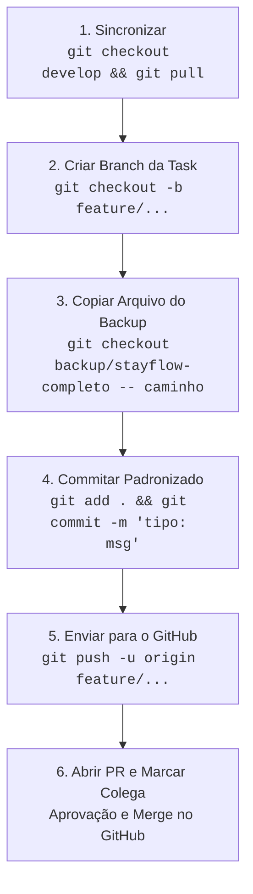

# 🛠️ Guia Prático de Execução das Tasks — Equipe Bravo (2026.2)

**Projeto:** StayFlow — Sistema de Gestão Hoteleira  
**Repositório:** [https://github.com/DevKelvinbd/est_web_2026_2_turma_b_bravo](https://github.com/DevKelvinbd/est_web_2026_2_turma_b_bravo)  
**Documento de Referência:** [05_playbook_execucao_diaria_equipe.md](./05_playbook_execucao_diaria_equipe.md)

---

## 🎯 Objetivo deste Guia

Este documento é o manual prático e visual para todos os integrantes da equipe (**Kelvin, Paula, Guilherme, Bianca e Raul**). Ele explica exatamente **o que fazer**, **como rodar cada comando**, **como abrir o Pull Request (PR)** e **como o colega deve aprovar e mesclar** no GitHub.

> [!TIP]
> **Você não precisará programar nada do zero.** Todo o código-fonte já está pronto e validado na branch `backup/stayflow-completo`. Sua única função é extrair os arquivos, commitar no padrão, abrir o PR e aprovar as entregas dos colegas.

---

## 🧭 1. Preparação Inicial (Fazer apenas uma vez)

Antes de iniciar o seu primeiro dia de trabalho:

1. **Clone o repositório na sua máquina:**
   ```bash
   git clone https://github.com/DevKelvinbd/est_web_2026_2_turma_b_bravo.git
   cd est_web_2026_2_turma_b_bravo
   ```
2. **Garanta que você possui a branch `develop` e a branch de backup mapeadas:**
   ```bash
   git fetch origin
   git checkout develop
   git pull origin develop
   ```

---

## 🔄 2. O Ciclo Padrão de 6 Passos para Qualquer Task

Sempre que chegar o seu dia na escala, siga rigorosamente este fluxo:



### Detalhamento dos 6 Passos:

1. **Sincronizar a branch `develop`:**
   ```bash
   git checkout develop
   git pull origin develop
   ```
2. **Criar a branch da sua tarefa a partir da `develop`:**
   ```bash
   git checkout -b <nome-da-branch>
   ```
3. **Extrair os arquivos prontos da branch `backup/stayflow-completo`:**
   ```bash
   git checkout backup/stayflow-completo -- <arquivo1> <arquivo2>
   ```
4. **Adicionar e criar o commit com a mensagem convencional:**
   ```bash
   git add <arquivos>
   git commit -m "<mensagem-do-playbook>"
   ```
5. **Enviar sua branch para o repositório remoto:**
   ```bash
   git push -u origin <nome-da-branch>
   ```
6. **Abrir o Pull Request no GitHub:**
   * Acesse a página do repositório no GitHub.
   * Clique em **"Compare & pull request"**.
   * **Base repository:** `develop` (⚠️ NUNCA selecione `main`).
   * **Título do PR:** `[Sprint X] Tipo: Descrição resumida`
   * **Reviewers:** Selecione no menu lateral direito o colega definido no ciclo de Code Review.

---

## 📋 3. Roteiro Passo a Passo de Cada Tarefa (Dias 1 ao 17)

---

### 🚀 SPRINT 1 — Fundação e Setup

#### 📌 Dia 1 | Tarefa 1.1 — Atualização de Dependências e Docker
* **Quem executa:** **Raul de Queiroz Moura**
* **Quem aprova o PR:** **Kelvin Barros Dias**
* **O que faz:** Atualiza os manifests de dependências (`requirements.txt`, `pyproject.toml`) e regras do `.gitignore`.
* **Comandos para copiar e colar:**
  ```bash
  git checkout develop
  git pull origin develop
  git checkout -b chore/docker-env-config
  git checkout backup/stayflow-completo -- .gitignore apps/services/core-service/requirements.txt apps/services/core-service/pyproject.toml
  git add .gitignore apps/services/core-service/requirements.txt apps/services/core-service/pyproject.toml
  git commit -m "chore(infra): atualiza dependencias e variaveis de ambiente da stack"
  git push -u origin chore/docker-env-config
  ```
* **No GitHub:** Abrir PR de `chore/docker-env-config` para `develop` marcando **Kelvin** como Reviewer.

---

#### 📌 Dia 2 | Tarefa 1.2 — Configuração de Conexão com Banco e Alembic
* **Quem executa:** **Guilherme Neves de Assis**
* **Quem aprova o PR:** **Francisca Bianca da Silva**
* **O que faz:** Configura a conexão SQLAlchemy e o ambiente de migrações automáticas do Alembic.
* **Comandos para copiar e colar:**
  ```bash
  git checkout develop
  git pull origin develop
  git checkout -b feature/db-initial-connection
  git checkout backup/stayflow-completo -- apps/services/core-service/app/core/config.py apps/services/core-service/alembic/env.py
  git add apps/services/core-service/app/core/config.py apps/services/core-service/alembic/env.py
  git commit -m "feat(db): configura conexao unificada sqlalchemy e alembic"
  git push -u origin feature/db-initial-connection
  ```
* **No GitHub:** Abrir PR de `feature/db-initial-connection` para `develop` marcando **Bianca** como Reviewer.

---

#### 📌 Dia 3 | Tarefa 1.3 — Shell de Layout e Design System CSS
* **Quem executa:** **Paula de Freitas Mendes Barbosa**
* **Quem aprova o PR:** **Guilherme Neves de Assis**
* **O que faz:** Cria a estrutura visual da aplicação React, componentes `Navbar`, `Footer` e tokens de estilo `index.css`.
* **Comandos para copiar e colar:**
  ```bash
  git checkout develop
  git pull origin develop
  git checkout -b feature/frontend-shell-layout
  git checkout backup/stayflow-completo -- apps/frontend/package.json apps/frontend/package-lock.json apps/frontend/src/components/layout/Navbar.jsx apps/frontend/src/components/layout/Footer.jsx apps/frontend/src/index.css
  git add apps/frontend/package.json apps/frontend/package-lock.json apps/frontend/src/components/layout/Navbar.jsx apps/frontend/src/components/layout/Footer.jsx apps/frontend/src/index.css
  git commit -m "feat(frontend): cria componentes de layout Navbar, Footer e tokens css"
  git push -u origin feature/frontend-shell-layout
  ```
* **No GitHub:** Abrir PR de `feature/frontend-shell-layout` para `develop` marcando **Guilherme** como Reviewer.

---

### 🔑 SPRINT 2 — Autenticação JWT & RBAC

#### 📌 Dia 4 | Tarefa 2.1 — Modelo de Usuário, Hash Bcrypt e Segurança JWT
* **Quem executa:** **Kelvin Barros Dias**
* **Quem aprova o PR:** **Paula de Freitas Mendes Barbosa**
* **O que faz:** Cria a entidade `Usuario`, funções de hash seguro com bcrypt e gerador de tokens JWT.
* **Comandos para copiar e colar:**
  ```bash
  git checkout develop
  git pull origin develop
  git checkout -b feature/auth-security-jwt-backend
  git checkout backup/stayflow-completo -- apps/services/core-service/app/models/usuario.py apps/services/core-service/app/core/security.py apps/services/core-service/app/schemas/auth.py
  git add apps/services/core-service/app/models/usuario.py apps/services/core-service/app/core/security.py apps/services/core-service/app/schemas/auth.py
  git commit -m "feat(auth): implementa modelo de usuario, hash bcrypt e geracao jwt"
  git push -u origin feature/auth-security-jwt-backend
  ```
* **No GitHub:** Abrir PR de `feature/auth-security-jwt-backend` para `develop` marcando **Paula** como Reviewer.

---

#### 📌 Dia 5 | Tarefa 2.2 — Serviço de Auth, Dependências RBAC e Endpoints
* **Quem executa:** **Francisca Bianca da Silva**
* **Quem aprova o PR:** **Raul de Queiroz Moura**
* **O que faz:** Implementa o serviço de autenticação, injeção de dependências para verificar usuário/admin e endpoints de `/register`, `/login` e `/me`.
* **Comandos para copiar e colar:**
  ```bash
  git checkout develop
  git pull origin develop
  git checkout -b feature/auth-endpoints-service
  git checkout backup/stayflow-completo -- apps/services/core-service/app/services/auth_service.py apps/services/core-service/app/api/deps.py apps/services/core-service/app/api/v1/auth.py apps/services/core-service/app/db/__init__.py apps/services/core-service/app/db/seed.py
  git add apps/services/core-service/app/services/auth_service.py apps/services/core-service/app/api/deps.py apps/services/core-service/app/api/v1/auth.py apps/services/core-service/app/db/__init__.py apps/services/core-service/app/db/seed.py
  git commit -m "feat(auth): implementa servico de autenticacao, dependencias rbac e endpoints auth"
  git push -u origin feature/auth-endpoints-service
  ```
* **No GitHub:** Abrir PR de `feature/auth-endpoints-service` para `develop` marcando **Raul** como Reviewer.

---

#### 📌 Dia 6 | Tarefa 2.3 — Telas de Login/Registro e Contexto de Autenticação
* **Quem executa:** **Paula de Freitas Mendes Barbosa**
* **Quem aprova o PR:** **Guilherme Neves de Assis**
* **O que faz:** Cria as páginas de Login e Cadastro, `AuthContext` para gerenciar estado global e interceptors Axios para injetar `Bearer Token`.
* **Comandos para copiar e colar:**
  ```bash
  git checkout develop
  git pull origin develop
  git checkout -b feature/frontend-auth-integration
  git checkout backup/stayflow-completo -- apps/frontend/src/services/api.js apps/frontend/src/contexts/AuthContext.jsx apps/frontend/src/components/layout/ProtectedRoute.jsx apps/frontend/src/pages/LoginPage.jsx apps/frontend/src/pages/RegisterPage.jsx
  git add apps/frontend/src/services/api.js apps/frontend/src/contexts/AuthContext.jsx apps/frontend/src/components/layout/ProtectedRoute.jsx apps/frontend/src/pages/LoginPage.jsx apps/frontend/src/pages/RegisterPage.jsx
  git commit -m "feat(frontend): implementa auth context, interceptor jwt e telas de login e cadastro"
  git push -u origin feature/frontend-auth-integration
  ```
* **No GitHub:** Abrir PR de `feature/frontend-auth-integration` para `develop` marcando **Guilherme** como Reviewer.

---

#### 📌 Dia 7 | Tarefa 2.4 — Suíte de Testes Automatizados JWT & RBAC
* **Quem executa:** **Raul de Queiroz Moura**
* **Quem aprova o PR:** **Kelvin Barros Dias**
* **O que faz:** Adiciona fixtures de banco de testes em `conftest.py` e testes de integração com Pytest cobrindo fluxos de login, cadastro e permissões 401/403.
* **Comandos para copiar e colar:**
  ```bash
  git checkout develop
  git pull origin develop
  git checkout -b test/auth-integration-suite
  git checkout backup/stayflow-completo -- apps/services/core-service/tests/conftest.py apps/services/core-service/tests/test_auth_jwt.py
  git add apps/services/core-service/tests/conftest.py apps/services/core-service/tests/test_auth_jwt.py
  git commit -m "test(auth): implementa suite de testes automatizados para fluxos jwt e rbac"
  git push -u origin test/auth-integration-suite
  ```
* **No GitHub:** Abrir PR de `test/auth-integration-suite` para `develop` marcando **Kelvin** como Reviewer.

---

### 🏨 SPRINT 3 — Domínio Hoteleiro & Catálogo de Hotéis

#### 📌 Dia 8 | Tarefa 3.1 — Modelos ORM e Schemas Pydantic do Domínio Hoteleiro
* **Quem executa:** **Francisca Bianca da Silva**
* **Quem aprova o PR:** **Raul de Queiroz Moura**
* **O que faz:** Mapeia as entidades `Cidade`, `Hotel`, `Quarto`, `Comodidade` no SQLAlchemy e cria os schemas Pydantic.
* **Comandos para copiar e colar:**
  ```bash
  git checkout develop
  git pull origin develop
  git checkout -b feature/hotel-models-schemas
  git checkout backup/stayflow-completo -- apps/services/core-service/app/models/cidade.py apps/services/core-service/app/models/hotel.py apps/services/core-service/app/models/comodidade.py apps/services/core-service/app/models/quarto.py apps/services/core-service/app/models/__init__.py apps/services/core-service/app/schemas/hotelaria.py
  git add apps/services/core-service/app/models/cidade.py apps/services/core-service/app/models/hotel.py apps/services/core-service/app/models/comodidade.py apps/services/core-service/app/models/quarto.py apps/services/core-service/app/models/__init__.py apps/services/core-service/app/schemas/hotelaria.py
  git commit -m "feat(models): implementa modelos orm e schemas pydantic para cidade, hotel, quarto e comodidades"
  git push -u origin feature/hotel-models-schemas
  ```
* **No GitHub:** Abrir PR de `feature/hotel-models-schemas` para `develop` marcando **Raul** como Reviewer.

---

#### 📌 Dia 9 | Tarefa 3.2 — Endpoints de Catálogo e Migração Alembic
* **Quem executa:** **Guilherme Neves de Assis**
* **Quem aprova o PR:** **Francisca Bianca da Silva**
* **O que faz:** Cria a rota de busca de hotéis `/api/v1/hoteis` (filtros por preço, cidade, estrelas) e o script de migração Alembic.
* **Comandos para copiar e colar:**
  ```bash
  git checkout develop
  git pull origin develop
  git checkout -b feature/hotel-catalog-api
  git checkout backup/stayflow-completo -- apps/services/core-service/app/api/v1/hoteis.py apps/services/core-service/alembic/versions/f519176e1f37_add_stayflow_domain_models.py
  git add apps/services/core-service/app/api/v1/hoteis.py apps/services/core-service/alembic/versions/f519176e1f37_add_stayflow_domain_models.py
  git commit -m "feat(api): implementa endpoints de busca e catalogo de hoteis e migracao alembic"
  git push -u origin feature/hotel-catalog-api
  ```
* **No GitHub:** Abrir PR de `feature/hotel-catalog-api` para `develop` marcando **Bianca** como Reviewer.

---

#### 📌 Dia 10 | Tarefa 3.3 — Telas de Busca de Hotéis e Detalhes da Acomodação
* **Quem executa:** **Paula de Freitas Mendes Barbosa**
* **Quem aprova o PR:** **Guilherme Neves de Assis**
* **O que faz:** Cria a página inicial com busca inteligente (`HomePage.jsx`) e a página de visualização do hotel com quartos disponíveis (`HotelDetailPage.jsx`).
* **Comandos para copiar e colar:**
  ```bash
  git checkout develop
  git pull origin develop
  git checkout -b feature/frontend-hotel-catalog
  git checkout backup/stayflow-completo -- apps/frontend/src/pages/HomePage.jsx apps/frontend/src/pages/HotelDetailPage.jsx
  git add apps/frontend/src/pages/HomePage.jsx apps/frontend/src/pages/HotelDetailPage.jsx
  git commit -m "feat(frontend): implementa telas de home com busca de hoteis e detalhes com quartos"
  git push -u origin feature/frontend-hotel-catalog
  ```
* **No GitHub:** Abrir PR de `feature/frontend-hotel-catalog` para `develop` marcando **Guilherme** como Reviewer.

---

### 💳 SPRINT 4 — Motor de Reservas & Precificação Dinâmica

#### 📌 Dia 11 | Tarefa 4.1 — Motor de Precificação Dinâmica e Modelos de Reserva
* **Quem executa:** **Kelvin Barros Dias**
* **Quem aprova o PR:** **Paula de Freitas Mendes Barbosa**
* **O que faz:** Cria as entidades `Reserva`, `TarifaTemporada`, `ServicoAdicional` e o serviço `pricing_service.py` para cálculo de diárias e sazonais.
* **Comandos para copiar e colar:**
  ```bash
  git checkout develop
  git pull origin develop
  git checkout -b feature/booking-pricing-engine
  git checkout backup/stayflow-completo -- apps/services/core-service/app/models/reserva.py apps/services/core-service/app/models/tarifa_temporada.py apps/services/core-service/app/models/servico_adicional.py apps/services/core-service/app/services/pricing_service.py
  git add apps/services/core-service/app/models/reserva.py apps/services/core-service/app/models/tarifa_temporada.py apps/services/core-service/app/models/servico_adicional.py apps/services/core-service/app/services/pricing_service.py
  git commit -m "feat(pricing): implementa modelos de reservas e temporadas com motor de precificacao dinamica"
  git push -u origin feature/booking-pricing-engine
  ```
* **No GitHub:** Abrir PR de `feature/booking-pricing-engine` para `develop` marcando **Paula** como Reviewer.

---

#### 📌 Dia 12 | Tarefa 4.2 — Endpoints REST para Criação e Gestão de Reservas
* **Quem executa:** **Francisca Bianca da Silva**
* **Quem aprova o PR:** **Raul de Queiroz Moura**
* **O que faz:** Implementa o endpoint `/api/v1/reservas` com cálculo de preço em tempo real, verificação de datas e cancelamento.
* **Comandos para copiar e colar:**
  ```bash
  git checkout develop
  git pull origin develop
  git checkout -b feature/booking-api-endpoints
  git checkout backup/stayflow-completo -- apps/services/core-service/app/api/v1/reservas.py
  git add apps/services/core-service/app/api/v1/reservas.py
  git commit -m "feat(api): implementa endpoints de criacao, simulacao e cancelamento de reservas"
  git push -u origin feature/booking-api-endpoints
  ```
* **No GitHub:** Abrir PR de `feature/booking-api-endpoints` para `develop` marcando **Raul** como Reviewer.

---

#### 📌 Dia 13 | Tarefa 4.3 — Tela de Checkout com Simulação em Tempo Real
* **Quem executa:** **Guilherme Neves de Assis**
* **Quem aprova o PR:** **Francisca Bianca da Silva**
* **O que faz:** Constrói a tela interativa de Checkout (`CheckoutPage.jsx`) com seleção de datas, cálculo dinâmico via API e seleção de serviços extras.
* **Comandos para copiar e colar:**
  ```bash
  git checkout develop
  git pull origin develop
  git checkout -b feature/frontend-checkout-booking
  git checkout backup/stayflow-completo -- apps/frontend/src/pages/CheckoutPage.jsx
  git add apps/frontend/src/pages/CheckoutPage.jsx
  git commit -m "feat(frontend): implementa tela de checkout com calculo em tempo real e servicos adicionais"
  git push -u origin feature/frontend-checkout-booking
  ```
* **No GitHub:** Abrir PR de `feature/frontend-checkout-booking` para `develop` marcando **Bianca** como Reviewer.

---

### 🎫 SPRINT 5 — Vouchers, Minhas Reservas & Avaliações

#### 📌 Dia 14 | Tarefa 5.1 — Telas de Status de Reserva, Voucher e Histórico
* **Quem executa:** **Paula de Freitas Mendes Barbosa**
* **Quem aprova o PR:** **Guilherme Neves de Assis**
* **O que faz:** Cria a tela de confirmação/voucher (`BookingStatusPage.jsx`) e a central de gestão do hóspede (`MyBookingsPage.jsx`).
* **Comandos para copiar e colar:**
  ```bash
  git checkout develop
  git pull origin develop
  git checkout -b feature/frontend-booking-status-voucher
  git checkout backup/stayflow-completo -- apps/frontend/src/pages/BookingStatusPage.jsx apps/frontend/src/pages/MyBookingsPage.jsx
  git add apps/frontend/src/pages/BookingStatusPage.jsx apps/frontend/src/pages/MyBookingsPage.jsx
  git commit -m "feat(frontend): implementa tela de status/voucher e painel de minhas reservas com cancelamento"
  git push -u origin feature/frontend-booking-status-voucher
  ```
* **No GitHub:** Abrir PR de `feature/frontend-booking-status-voucher` para `develop` marcando **Guilherme** como Reviewer.

---

#### 📌 Dia 15 | Tarefa 5.2 — Módulo de Avaliações e Notas dos Hotéis
* **Quem executa:** **Francisca Bianca da Silva**
* **Quem aprova o PR:** **Raul de Queiroz Moura**
* **O que faz:** Cria a tabela e endpoints de avaliações (`/api/v1/avaliacoes`), permitindo aos hóspedes registrar notas de 1 a 5 estrelas e comentários.
* **Comandos para copiar e colar:**
  ```bash
  git checkout develop
  git pull origin develop
  git checkout -b feature/reviews-ratings-api
  git checkout backup/stayflow-completo -- apps/services/core-service/app/models/avaliacao.py apps/services/core-service/app/api/v1/avaliacoes.py
  git add apps/services/core-service/app/models/avaliacao.py apps/services/core-service/app/api/v1/avaliacoes.py
  git commit -m "feat(api): implementa modelo e endpoints de avaliacoes e notas de hoteis"
  git push -u origin feature/reviews-ratings-api
  ```
* **No GitHub:** Abrir PR de `feature/reviews-ratings-api` para `develop` marcando **Raul** como Reviewer.

---

### 📊 SPRINT 6 — Painel Administrativo & Orquestração Final

#### 📌 Dia 16 | Tarefa 6.1 — Endpoints Administrativos e Registro Geral da API
* **Quem executa:** **Raul de Queiroz Moura**
* **Quem aprova o PR:** **Kelvin Barros Dias**
* **O que faz:** Implementa os endpoints do painel de administração (`/api/v1/admin`) e conecta todos os routers no arquivo principal `app/main.py`.
* **Comandos para copiar e colar:**
  ```bash
  git checkout develop
  git pull origin develop
  git checkout -b feature/admin-dashboard-backend
  git checkout backup/stayflow-completo -- apps/services/core-service/app/api/v1/admin.py apps/services/core-service/app/main.py
  git add apps/services/core-service/app/api/v1/admin.py apps/services/core-service/app/main.py
  git commit -m "feat(admin): implementa endpoints administrativos de gestao e registro geral de rotas"
  git push -u origin feature/admin-dashboard-backend
  ```
* **No GitHub:** Abrir PR de `feature/admin-dashboard-backend` para `develop` marcando **Kelvin** como Reviewer.

---

#### 📌 Dia 17 | Tarefa 6.2 — Painel Administrativo e Roteamento Geral da Aplicação
* **Quem executa:** **Kelvin Barros Dias**
* **Quem aprova o PR:** **Paula de Freitas Mendes Barbosa**
* **O que faz:** Cria a interface completa de gestão administrativa (`AdminDashboard.jsx`) e fecha o roteamento final do React em `App.jsx` e `main.jsx`.
* **Comandos para copiar e colar:**
  ```bash
  git checkout develop
  git pull origin develop
  git checkout -b feature/admin-dashboard-frontend
  git checkout backup/stayflow-completo -- apps/frontend/src/pages/admin/AdminDashboard.jsx apps/frontend/src/App.jsx apps/frontend/src/main.jsx apps/frontend/index.html
  git add apps/frontend/src/pages/admin/AdminDashboard.jsx apps/frontend/src/App.jsx apps/frontend/src/main.jsx apps/frontend/index.html
  git commit -m "feat(frontend): implementa painel administrativo integrado e rotas protegidas no app"
  git push -u origin feature/admin-dashboard-frontend
  ```
* **No GitHub:** Abrir PR de `feature/admin-dashboard-frontend` para `develop` marcando **Paula** como Reviewer.

---

## 🔍 4. Como o Revisor Deve Aprovar o PR no GitHub

Quando o seu colega abrir o Pull Request e marcar você como Reviewer:

1. Acesse a aba **Pull Requests** do repositório no GitHub.
2. Clique no PR aberto pelo seu colega.
3. Clique na aba **"Files changed"** (canto superior direito) para visualizar os arquivos.
4. Clique no botão verde **"Review changes"**:
   * Selecione **"Approve"**.
   * Adicione um comentário positivo (ex: *"Código validado e em conformidade com o padrão do projeto. Aprovado!"*).
   * Clique em **"Submit review"**.
5. Retorne à aba **"Conversation"**, clique no botão **"Merge pull request"** (ou "Squash and merge") e depois em **"Confirm merge"**.
6. Pronto! A tarefa está oficialmente integrada na branch `develop`.

---

## ❓ 5. Dúvidas Frequentes & Resolução de Problemas

* **Erro:** *"fatal: invalid reference: backup/stayflow-completo"*  
  **Solução:** Atualize suas referências remotas rodando:
  ```bash
  git fetch origin
  ```

* **Erro:** *"Your branch is behind 'origin/develop'"*  
  **Solução:** Sempre atualize sua branch `develop` antes de criar a nova branch:
  ```bash
  git checkout develop
  git pull origin develop
  ```

* **Dúvida:** *"Como testar o sistema completo localmente se eu quiser ver rodando?"*  
  **Solução:**
  ```bash
  docker compose up -d --build
  ```
  Acesse no navegador:
  * **Frontend:** `http://localhost:5173`
  * **Backend API Docs:** `http://localhost:8000/docs`
